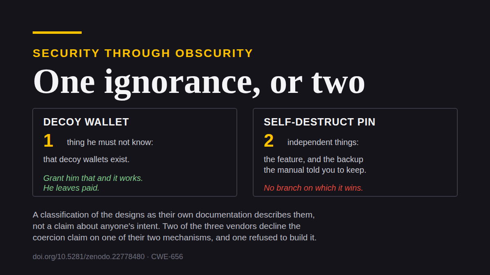

# Obscurity, the Clearest Problem Nobody Talks About

Anyone who has sat through a protocol design course met Kerckhoffs's principle
in about the second week. It's the one everybody can recite. And this community,
which will argue for six hours about whether a wallet's RNG is trustworthy, ships
physical-coercion defenses built on security through obscurity, and they fail on
the first page of the manual.

Not subtly. The manuals say so themselves, and this piece is mostly just quoting
them.

## What Kerckhoffs actually says

Put the jargon aside. A system has to stay secure when the attacker knows exactly
how it works. Everything except the key is public: the design, the software, the
procedure, the fact that the procedure exists. You judge a design by how it
performs against someone who has read the same documentation you have.

That isn't pessimism about attackers. It's an admission about publication. The
moment a defense ships to consumers, its description is in a support article, in
the attacker's language, indexed, free.

### Security through obscurity has a catalog number

The family of tactics that breaks this rule has a name and a filing number.
*Reliance on Security Through Obscurity*, cataloged as
[CWE-656](https://cwe.mitre.org/data/definitions/656.html). In any other software
domain that entry is a defect you fix. In bitcoin custody it's the consensus
recommendation.

And this paradigm, which protocol design calls **obscurity**, is inherently
condescending. It assumes the thief isn't mentally capable of reading the same
manuals, watching the same tutorials and taking the same courses as his victims.
If you can learn a procedure on the internet, so can a thief, and he'll certainly
know the procedure exists.

Aim that at the assumption, not at anyone holding it. The people shipping these
features are careful engineers who got one premise wrong. It happens to be the
load-bearing one.

## Three bets on what an attacker will believe

The standing counsel comes in three parts: hold quietly, deny if asked, keep
something small to hand over. Restate them without the reassurance and they're
three wagers on an adversary's state of mind. Not three controls. Three guesses
about what someone else will think, made by the person with the least ability to
check.

A control works when the attacker knows about it. That's the whole distinction,
and every mechanism below fails on that side of it.

## The class, in the vendors' own words

I'm going to quote documentation rather than characterize it, because the
classification does the work and characterizing it invites an argument about
motive that nobody needs.

### The erase PIN, and the backup it assumes

Blockstream's Jade ships an alternate PIN that, in the help center's words,
"automatically delete[s] the encrypted wallet information from Jade if entered".
It's presented as "especially useful in the event of a physical threat, as you
can provide this PIN to an attacker". Enter it and the device reports only
"Internal Error", so the erasure reads as a malfunction rather than a decision.

Credit where it's due: the erasure itself is real, instant, and can't be
interrupted. There's no race to win.

Now read the next warning on the same page. Afterwards "there is no way to regain
access to your funds except by restoring using your recovery phrase", so the
holder should "make sure you have a backup before proceeding".

The feature presupposes a backup. A holder who follows the documentation has one;
a holder who doesn't has destroyed their own savings under pressure. So what the
erasure removes is not the secret. It removes the *device* path to the secret,
and leaves standing the path that runs through the person's memory of where the
backup is.

The erasure deletes the route that required hurting nobody, and keeps the one
that doesn't.

### Coldcard documents the regress

You don't have to derive the next step. A vendor published it.

Coldcard ships trick PINs, including a duress wallet described as "a personal
safety feature… If you must reveal a PIN under duress, give the duress PIN
instead of your Main PIN". Ordinary decoy logic. The firmware documentation then
considers what happens when the decoy isn't believed, and its advice is to
escalate: "you may be asked what the actual duress PIN is, while under duress. We
suggest providing the 'brickme' PIN in that case."

That's a manufacturer contemplating an attacker who knows decoys exist, and
recommending an irreversible erasure performed with the victim still in the room,
still breathing, still able to be asked where the backup is.

Two further admissions on the same page are worth quoting because vendors rarely
make them. The first concedes the decoy is distinguishable: "if you are somehow
facing an attacker who is willing to verify he has the real main PIN, it's
possible that careful analysis of system responses will imply he's working with
the duress PIN." The remedy offered isn't a repair. It's a request: "if you
discover any sequences that reveal this easily, please tell us and we'll see if
we can cover them up better."

Obscurity stated as a maintenance program. What's being defended isn't that the
decoy is indistinguishable, but that nobody has published how to distinguish it
yet. A scheme whose security is the current state of the disclosure backlog is a
scheme you can't invoke in the room, because you have no idea what the man in
front of you has read.

The second admission is the denial itself, offered where bricking is unpalatable:
"alternatively, you can say you set the duress PIN once, but have since forgotten
it."

You cannot prove you forgot. That's the whole of the companion paper in five
words, and here it is as published guidance. The vendor enumerated the branches
and found a bluff on each one.

### What each vendor actually claims

This matters and it's where most criticism of this kind goes wrong. The three
firms don't make the same claims, and a vendor who ships a mechanism without
claiming it defeats coercion hasn't made the error this piece is about.

Blockstream markets the erasure for physical threat, and claims nothing of the
sort for its passphrase wallets. The duress framing of passphrase decoys is the
community's invention, not the manufacturer's. Coldcard markets both halves.
Trezor is Blockstream's mirror image: its passphrase wallets are sold on
deniability, while its wipe code, which the vendor itself calls a "self-destruct"
PIN and which erases the recovery seed, is documented with no mention of duress,
coercion or physical threat at all.

Trezor is also the one that was asked, in January 2022, to make the wipe
*concealable* — a user-defined message on entry, so an erasure could pass as a
hardware fault. The request was closed as **not planned**. The device still
announces the wipe plainly.

That refusal is the most interesting document in the whole class. It shows the
"Internal Error" disguise isn't intrinsic to erasure at all. It's a presentation
choice: one vendor built it, another was asked for it directly and declined.

### One ignorance, or two

There's a clean way to rank these, and it isn't by how likely the attacker is to
be ignorant. It's by how many separate things he has to be ignorant *of*.

A decoy needs one. He must not know decoys exist. Grant him that and the decoy
genuinely works: he leaves with a plausible balance and a story that closes.

A self-destruct needs two, and they're independent. He must not know the feature
exists, so the failure reads as breakage. And he must not reason his way to a
backup, which the manual told the holder to keep. The second doesn't follow from
the first. "This device is broken" has never implied "this person has no
bitcoin". It implies the instrument is broken, and the natural next question is
where you keep the backup, asked of someone still standing there.

So against an informed attacker the self-destruct fails for the ordinary
Kerckhoffs reason, and against an ignorant one it fails anyway, because the
belief it manufactures doesn't end the encounter. It's the one obscure scheme
with no branch on which it wins.

There's a quieter version of the same failure. Sparrow's FAQ documents a flag for
storing wallet data on removable media, noting that it "allows you to store all
Sparrow data on removable media making for more plausible deniability". Sparrow's
own best-practice page keeps the seed words backed up separately, "ideally in a
different location". So an attacker coerces the seed backup, loads it into his
own wallet, and never touches the concealed medium. A decoy at least stands
between him and the coins. This stands nowhere near them, and what it adds is the
confidence to make a denial.

## Eighty-eight people, twelve cases

The class assumes an adversary the record says doesn't exist.

French prosecutors have charged 88 people across a dozen crypto-linked kidnapping
and extortion cases, which is a point-in-time count from an active series of
prosecutions rather than a closed tally. CertiK's count for the first half of
2026 has home invasions going from 1 to 20 out of 52 incidents year on year,
which is one firm's half-year sample rather than the public registry, so read the
direction and not the decimal.

Whatever the exact figures settle at, they describe organized crews with
reconnaissance and victim selection running off leaked databases. Not opportunists
who can't read a support page in the language it was written in.

## The backfire

Obscurity isn't only ineffective. Sold at scale, it's self-defeating, and the
people it hurts most never bought it.

The decoy isn't just a tolerated practice. It's a product and a curriculum. A
Spanish-language self-custody consultancy lists among its paid tiers
"*Passphrase (tu bóveda señuelo)* — Billetera señuelo + billetera real. Protección
ante coacción/coerción": a decoy wallet marketed, in as many words, as protection
against coercion. Published guides coach the performance. One has the holder keep
a small balance on the bare seed as what you'd hand over under physical coercion,
adding that "for this to work, the decoy balance must be *believable* — enough to
look like a real wallet, not enough to devastate you if lost."

Read that as a training objective and the problem is visible. A decoy only needs
to be believable to an attacker who might disbelieve it, and the advice goes
quiet on what happens when he does, which is the entire question. Security
through obscurity is being sold here as though it were a control, priced and
taught.

### Denial is a commons, and it is being drained

Publicized training raises the prior that a fluent denial was rehearsed. Once an
attacker knows credibility is taught and sold, fluency stops being evidence of
truth and starts being evidence of coaching. The remedy degrades the thing it
sells.

And it degrades it for everyone. A holder who never trained, who is telling the
plain truth, now denies into an attacker who discounts fluent denials generally.
So does someone who holds no bitcoin at all. The full development of that is
*The Denial Spiral*, and it's the reason this series treats obscurity as a public
health problem rather than a personal one.

Hiding needs somewhere to hide. What a discreet holder disappears into is the
enormous crowd of people who visibly don't hold bitcoin, and that only works
while the crowd is mostly genuine. Coach enough people to present as ordinary
and ordinary stops carrying information, because the attacker isn't sorting
holders from non-holders any more. If everyone is a needle, there is no hay.

<em>Structural, not measured. Nobody has counted how many
holders practice discretion, and by mechanism 1 nobody can: obscurity doesn't
advertise itself. The claim is about what happens to the crowd as coaching
spreads, not about where the crowd is today.</em>

## A public design makes an ordinary denial more credible

One last inversion, and it's the part I find genuinely surprising.

An obscure defense asks the attacker to believe a claim, against his incentive to
disbelieve it and with no way for either of you to settle it. A publicly
specified design changes what making that claim costs. An attacker who credits
that effective mechanisms are in circulation is crediting that lying isn't the
victim's only available tool, and a holder with real alternatives has less reason
to reach for a lie.

So a Kerckhoffs-clean design improves the standing of exactly those obscure
denials it was built to make unnecessary. Security through obscurity stays
unsound as a primary defense. It isn't indifferent which design it accompanies.

---

*The classification, the vendor documentation and the commons argument are
developed in* [***The Denial Spiral***](https://zenodo.org/doi/10.5281/zenodo.22778480)
*, open access, no signup. Its companion,*
[***The Deadly Race***](https://zenodo.org/doi/10.5281/zenodo.22018891)*, covers what
happens once the attacker is already in the room: a seizure that leaves a
feasible-but-unfinished path turns a robbery into a race, and prices your
elimination.*

*Every vendor quotation above is from public documentation, linked in the paper.
If I've misread a feature or a page has changed, tell me and I'll correct it in
public.*

---

**If this was worth your time.** Send it to someone who ships a duress PIN. A ⭐
on [Great Wall](https://github.com/Yuri-SVB/Great-Wallet),
[the research](https://github.com/Yuri-SVB/great-wall-docs) or
[these posts](https://github.com/Yuri-SVB/great-wall-posts) costs nothing and
makes the work easier to find. And if you want to fund it,
[support](https://github.com/Yuri-SVB/support) takes ⚡ Lightning and on-chain, no
signup, no tiers, nothing expected back.
