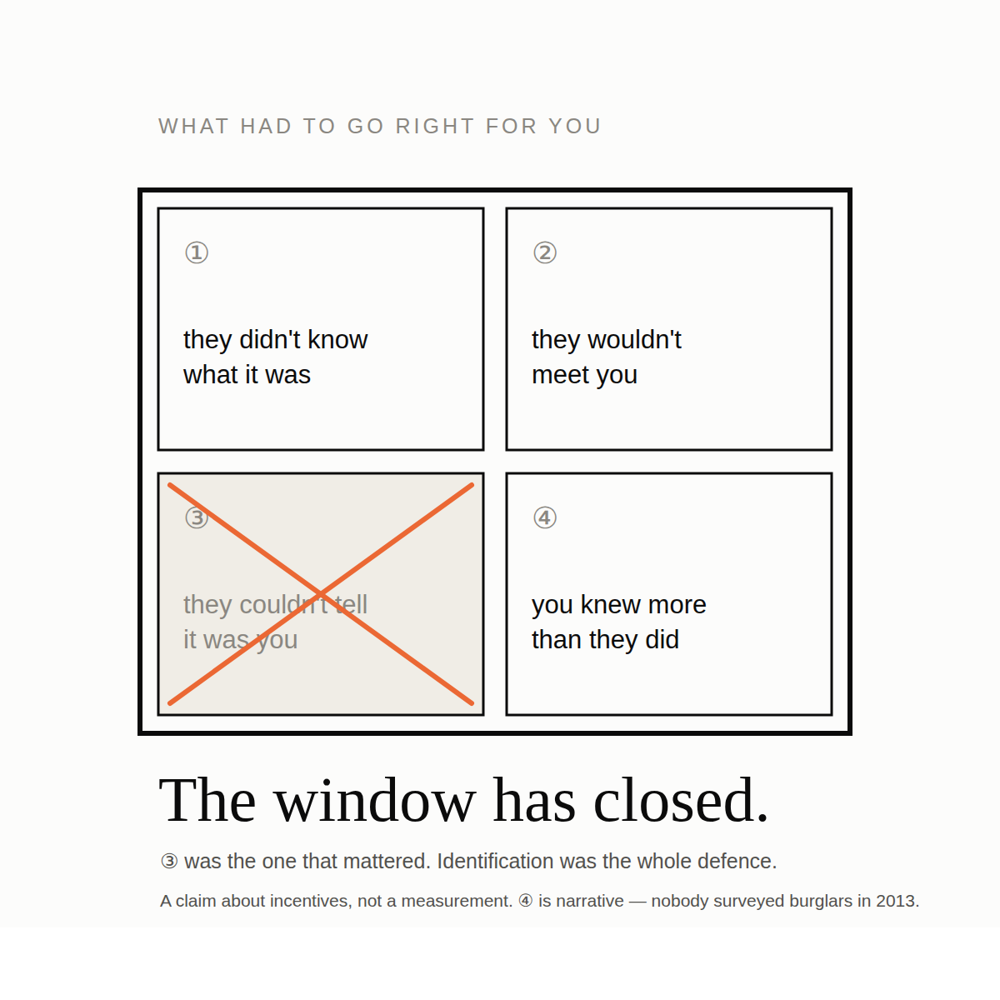
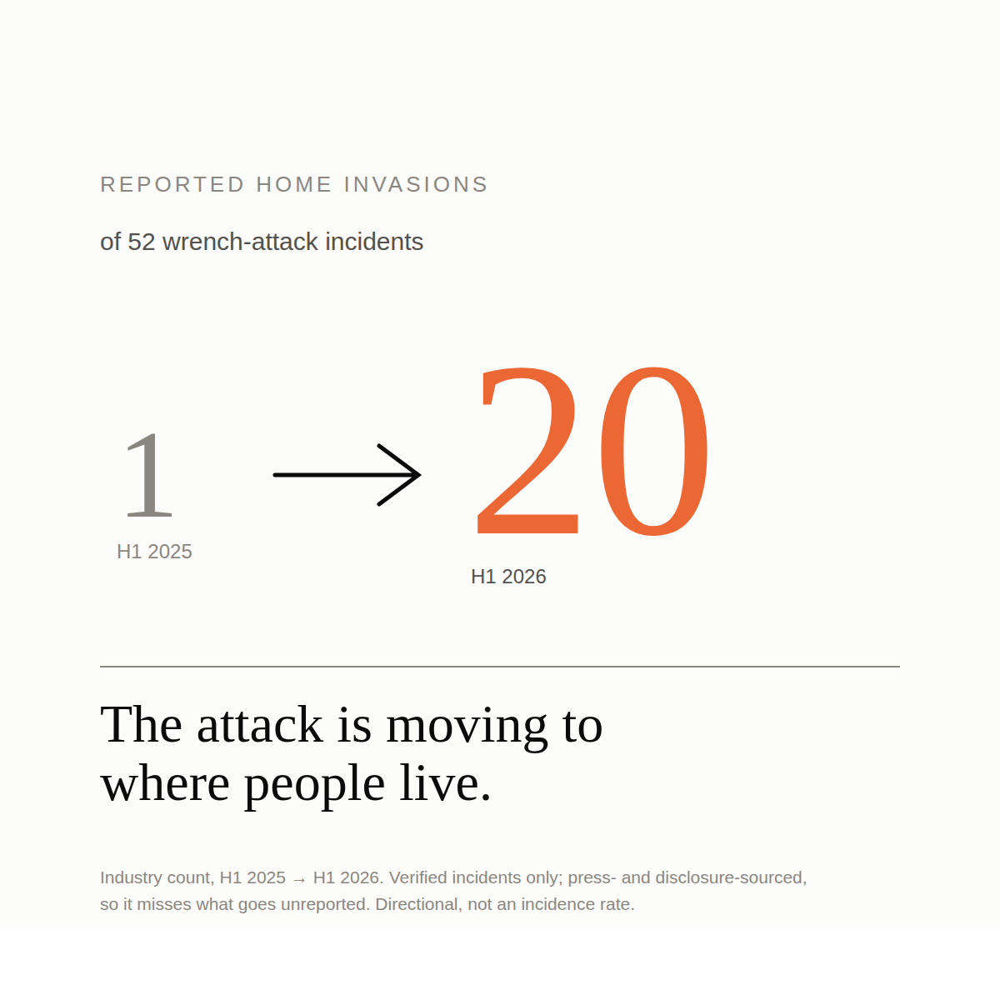
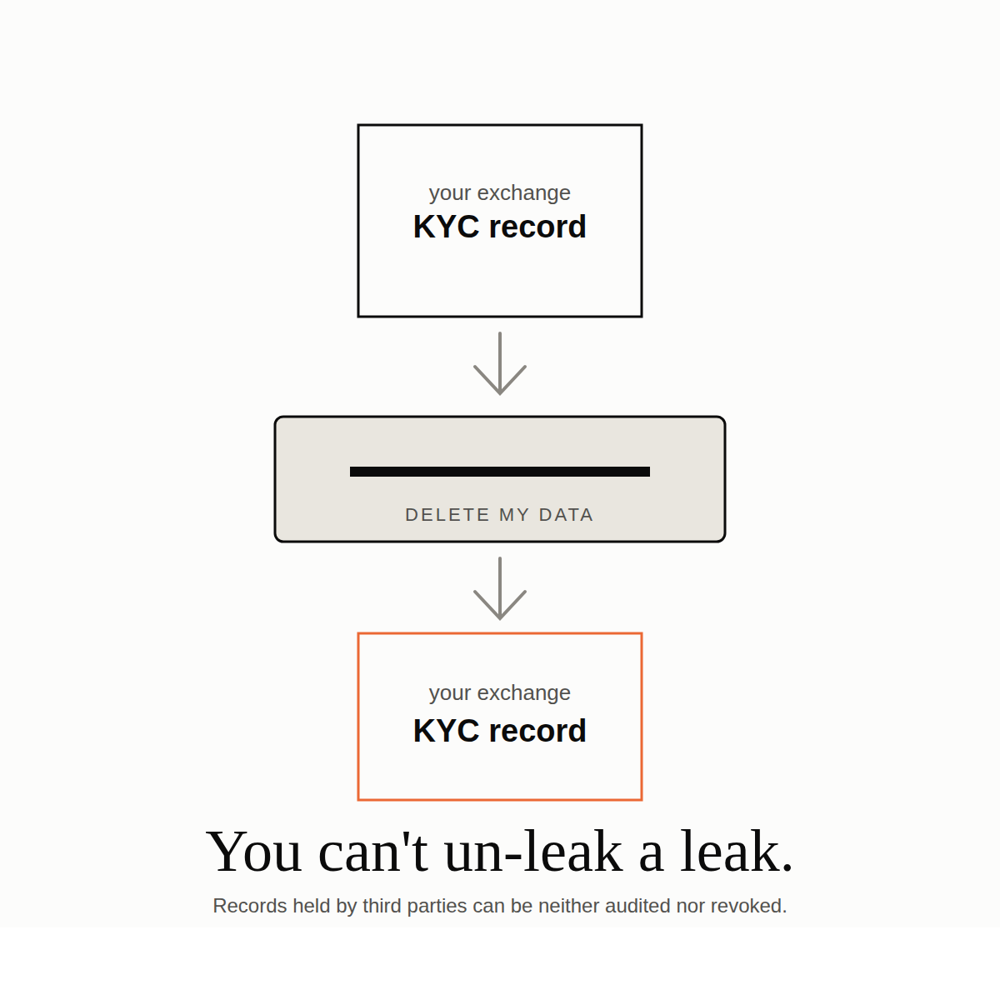
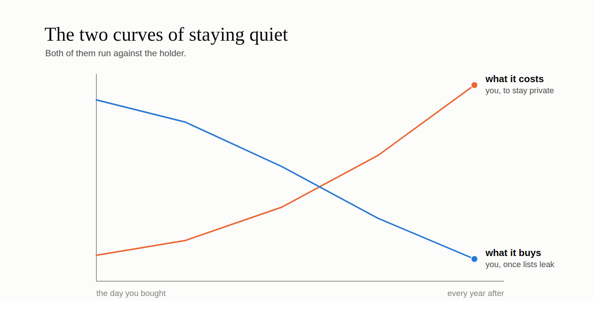

# La Fenêtre S'est Refermée

**Quatre choses étaient vraies autrefois quand on se faisait dépouiller de ses
bitcoins. Aucune ne l'est plus, aucune ne reviendra, et la quasi-totalité des
conseils qu'on vous a donnés pour vous protéger ont été calibrés pour le monde
dans lequel elles l'étaient.**

---

## Il fut un temps

Pensez à tout ce qui devait jouer en votre faveur, à l'époque, pour qu'une attaque
à la clé à molette n'ait tout simplement pas lieu.

**Premièrement, la plupart des voleurs n'avaient aucune idée de ce qu'était le
bitcoin.** Pas « le sous-estimaient » — n'avaient jamais entendu le mot. La
catégorie de criminel capable ne serait-ce que de former l'intention de vous voler
une clé privée était infime.

**Deuxièmement, même ceux qui savaient avaient peu de chances de vous croiser.**
Les détenteurs n'étaient pas nombreux. En rencontrer un par hasard, au cours d'un
cambriolage ordinaire, était une coïncidence qui, la plupart du temps, ne se
produisait pas.

**Troisièmement — et c'est celui qu'on oublie : encore fallait-il savoir que
c'était vous.** Croiser un détenteur n'est pas l'identifier. Sans moyen de
distinguer les détenteurs du reste du monde, savoir ce qu'est le bitcoin ne
rapporte rien au voleur. C'est une capacité sans ciblage.

**Quatrièmement, si les trois échouaient et que quelqu'un venait vraiment, vous en
saviez probablement plus que lui.** Le détenteur des débuts était typiquement un
cypherpunk, un cryptographe, quelqu'un qui avait lu la liste de diffusion.
L'agresseur était typiquement un amateur avec un plan improvisé dans la semaine.
L'asymétrie technique avait tendance à jouer pour la victime.

C'était une vraie fenêtre, et on y était réellement plutôt en sécurité.

## Ce qui a remplacé chacune d'elles

Dans l'ordre.

**Tout le monde sait ce qu'est le bitcoin.** Celle-là ne demande aucune
démonstration.

**Les détenteurs sont très nombreux.** Non plus.

**Et désormais, on peut savoir que c'est vous.** C'est celle-là qui a réellement
changé la donne, et j'y reviens dans un instant, parce qu'elle mérite sa propre
section.

**Et l'asymétrie s'est inversée.** Ceux qui font ça n'improvisent pas. Le parquet
français a mis en cause 88 personnes dans une douzaine d'affaires liées
d'enlèvement et d'extorsion — ce n'est pas une série d'opportunistes, ce sont des
organisations, avec repérages, division du travail et récidive. Pendant ce temps,
le détenteur qu'elles viennent chercher est aujourd'hui, statistiquement, une
personne ordinaire qui a acheté des bitcoins sur une application. Le duel
cryptographe-contre-amateur est devenu quelque chose de plus proche de son
contraire.

Le changement se lit aussi dans la forme des attaques. Dans un décompte sectoriel
du premier semestre 2026, les **cambriolages à domicile** signalés sont passés de
**1 à 20** sur 52 incidents d'une année sur l'autre. L'attaque se déplace là où
les gens vivent. Ce n'est pas le profil d'un délit d'opportunité.

Sur les décomptes en général : il existe plusieurs séries du nombre annuel de ces
faits, elles se contredisent sur les chiffres exacts, et elles s'accordent
entièrement sur la direction — une poignée par an avant 2017, des dizaines par an
aujourd'hui. Je préfère vous dire cela plutôt que choisir le chiffre le plus
alarmant et le présenter comme acquis. Les registres sont construits à partir de la
presse : ils manquent tout ce qui n'est pas signalé et surreprésentent ce qui a
fait l'actualité.

## La liste des cibles est désormais publique

Voici ce qui a refermé la fenêtre pour de bon.

Pour vous viser personnellement, un voleur a besoin d'une liste. Pendant presque
toute l'histoire du bitcoin, il n'y avait pas de liste. Il y en a maintenant
plusieurs, et vous n'avez consenti à aucune.

Les rapports de renseignement sur la vague de 2026 attribuent la sélection des
victimes à des bases de données fuitées, des dossiers fiscaux et des données de
plateformes d'échange — auxquels s'ajoutent la revente interne de fichiers clients
et le recrutement, sur le dark web, d'employés disposant d'un accès aux bases.
L'analyse de la chaîne se pose là-dessus. Et une décennie de gens parlant en ligne
de ce qu'ils possèdent se pose *par-dessus*.

Voyez de quelle nature est ce problème. Ce sont des **enregistrements détenus par
des tiers, que vous ne pouvez ni auditer ni révoquer.** On ne décrée pas un
enregistrement. On ne défuite pas une fuite. Ce que la plateforme sait de vous,
elle le sait définitivement — et quiconque obtiendra un jour ce qu'elle sait
aussi.

Ce qui donne à la discrétion une courbe de coût très inhabituelle, dont les deux
moitiés jouent contre vous. Le prix de rester discret s'accumule à chaque année de
détention et à chaque contrepartie rencontrée. Le bénéfice se réduit à mesure que
grossit le stock de fichiers déjà fuités, car votre discrétion ne vaut quelque
chose que si personne ne vous a déjà publié. Vous payez davantage, chaque année,
pour quelque chose qui vaut moins, chaque année.

Et si vous êtes en règle fiscalement, la stratégie n'est même pas disponible. Là
où les avoirs ou les plus-values sont déclarables, « ne laissez aucune trace »
n'est pas de la discrétion : c'est un délit. Le détenteur honnête s'entend donc
dire de se cacher par des gens qui n'ont pas remarqué que se cacher est une chose
que la loi ne lui permet pas.

J'ai tout un texte à venir sur l'affaire de l'administration fiscale française qui
met ce point hors de discussion. Pour l'instant : la liste existe, vous y êtes, et
on ne vous a jamais rien demandé.

## De quelle nature est cette affirmation

Une question légitime, à ce stade : comment sauriez-vous que tout cela est faux ?

Vous ne le sauriez pas, et je préfère le dire que l'habiller.

Ce n'est pas une prédiction que l'on puisse réfuter en comptant. C'est une
affirmation sur une structure — sur ce que font des gens soumis à ces incitations
et à ces contraintes. Les cas et les chiffres de ce texte sont des **illustrations
de la structure, pas des preuves de son existence**. Si le registre recensait
moitié moins d'attaques l'an prochain, pas une phrase ci-dessus n'en deviendrait
fausse ; les incitations resteraient exactement ce qu'elles sont.

Cela ressemble à une faiblesse. Il existe un argument plus long selon lequel ce
n'en est pas une — et un argument nettement plus dérangeant sur les raisons pour
lesquelles, dans ce domaine précis, les éléments qui *trancheraient* la question
sont systématiquement indisponibles. Les deux viendront dans un texte ultérieur.
Pour l'instant je le signale, simplement parce qu'un argument qui s'appuie en
sous-main sur des données qu'il ne peut pas produire fait quelque chose de
malhonnête, et je préfère le dire à voix haute.

## Le conseil a été hérité, pas dérivé

Voici le passage inconfortable.

Le conseil courant — restez discret, niez si on vous demande, gardez un petit
portefeuille à céder — est parfaitement sensé **dans le monde de ces quatre
conditions**. Dans un monde où presque personne ne vous cherche et où personne ne
peut vous distinguer dans la foule, se taire est presque une défense complète,
parce que l'attaque, le plus souvent, ne commence jamais.

Ce conseil n'a jamais été dérivé d'un modèle de menace. Il a été hérité d'une
époque. Et l'époque est finie.

Ce qu'il devient, une fois la fenêtre refermée, ce sont deux problèmes distincts
que je traiterai l'un après l'autre.

Le premier : il a cessé d'être un mécanisme. Une défense dont toute la force tient
à ce que l'attaquant ignore quelque chose n'est pas une défense sur laquelle on
peut compter une fois qu'il le sait — et en ingénierie de la sécurité cela porte un
nom et une entrée de catalogue, et tout le monde s'accorde à y voir un défaut de
conception, jusqu'au moment où l'actif concerné est du bitcoin. C'est le sujet du
texte d'après.

Le second est pire, et c'est la raison pour laquelle j'ai fini par écrire des
articles universitaires là-dessus plutôt qu'une liste de conseils. Dans les
conditions où nous vivons réellement, ce conseil ne se contente pas de ne plus
protéger. Il **aggrave la situation** — pendant l'attaque et après, et pas
seulement celle de la personne qui l'a suivi. Celui-là demande plus de place qu'un
billet de blog, et c'est là que se trouve le véritable argument.

Il n'existe aucune version de cette histoire où la fenêtre se rouvre. Chacune des
quatre conditions a disparu dans une direction qui ne s'inverse pas : la
connaissance ne se dé-répand pas, les détenteurs ne redeviennent pas rares, les
fichiers fuités ne se défuitent pas, et le crime organisé n'oublie pas un modèle
économique qui fonctionne.

La bonne nouvelle, si c'en est une, c'est qu'une défense qui n'a jamais dépendu de
l'ignorance de l'attaquant se moque éperdument de tout cela. Il se trouve qu'en
construire une est possible. Ce n'est simplement pas ce qu'on vous dit de faire.

---

*Les arguments complets sont dans deux articles en libre accès :*
[***The Deadly Race***](https://doi.org/10.5281/zenodo.22778256) *— ce qui découle
du fait qu'on ne peut pas prouver qu'on a oublié ; et*
[***The Denial Spiral***](https://doi.org/10.5281/zenodo.22778480) *— pourquoi le
conseil de dissimuler et de nier empire pour tout le monde à mesure qu'il est
suivi. Les deux sont gratuits, aucun n'exige d'inscription.*

*Les données d'incidents proviennent du* [*registre public des attaques physiques
de Jameson Lopp*](https://github.com/jlopp/physical-bitcoin-attacks)*, qui est un
échantillon de presse : il manque tout ce qui n'est pas signalé et surreprésente
ce qui a fait l'actualité. Les nouveaux cas que je trouve remontent vers ce
registre plutôt que vers une base de données à moi, parce que cette information
appartient à tout le monde — y compris au prochain sur la liste.*
