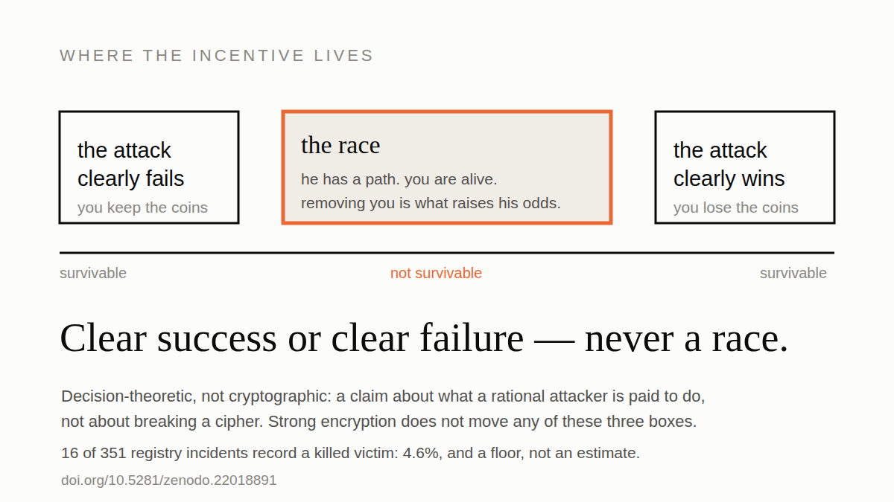
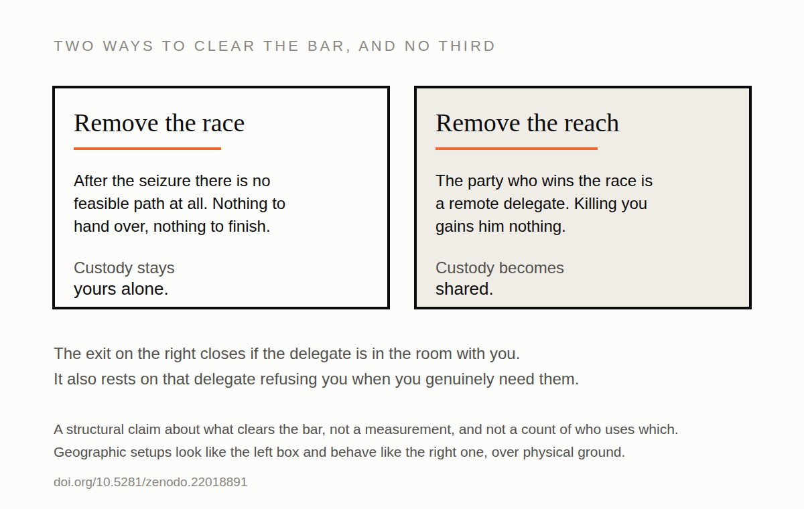

# La course mortelle

Tout plan d'autoconservation a un moment où il cesse d'être une affaire de
logiciel. Quelqu'un est chez vous. Il a votre portefeuille matériel, il a votre
téléphone, il vous a vous, et ce qui suivra ne sera pas réglé par votre source
d'entropie. Ce que vous attendez de votre dispositif à cet instant, c'est de la
résistance à la contrainte, et presque personne parmi ceux qui en vendent n'a
vérifié ce qu'il faudrait pour en avoir.

Presque toutes les conceptions ont une réponse pour ce moment, et c'est en
général une variante de *ils n'auront pas tout*. Une passphrase qu'ils n'ont
pas. Une clé dans une autre ville. Un secours à verrou temporel. Une graine
coupée en trois. La part rassurante est la même partout : une fois la rencontre
terminée, l'attaquant est encore loin de l'argent.

C'est justement cette assurance qui pose problème, et il vaut la peine de
dérouler pourquoi, parce que l'argument tient en quatre pas et que chacun pris
seul est ennuyeux.

## Ce que vous ne pouvez pas faire

Commençons par quelque chose qui a l'air d'un détail technique.

Vous pouvez prouver que vous connaissez un secret. Signer un message, produire
une préimage, dépenser depuis l'adresse. Prouver que vous ne le connaissez
*pas*, ou qu'aucune copie n'existe nulle part à votre portée, n'est pas une
version plus difficile de la même tâche. Il n'existe aucun protocole pour cela,
parce qu'il n'y a rien à exhiber. **Vous ne pouvez pas prouver que vous avez
oublié.**

Regardez le peu qu'il suffirait de cacher pour que ça tienne. Une carte SD. Un
mot de passe appris par cœur pour une boîte mail qui contient un fichier
chiffré. Quatre mots écrits dans la marge d'un livre sur une étagère. Rien de
tout cela n'est exotique, et rien de tout cela ne peut être écarté par quelqu'un
debout dans votre salon.

L'attaquant qui en a fini avec vous reste donc avec une question qu'il ne peut
pas clore : y a-t-il une autre copie ? Et il doit y répondre de la seule manière
rationnelle, qui est de supposer que oui.

## Ce que cela fait d'un vol

Assemblez les deux moitiés, et rappelez-vous de quel type d'actif il s'agit. Le
bitcoin est au porteur et il est rival : la première dépense valide emporte
tout, et il n'y a ni recours, ni rétrofacturation, ni assureur à appeler.

S'il repart avec un chemin vers vos bitcoins qui n'est pas achevé, et qu'il vous
relâche, vous voilà tous les deux pointés vers le même argent avec la même
horloge qui tourne. Lui avance sur ce qu'il a saisi. Vous marchez, pour autant
qu'il sache, vers une deuxième sauvegarde qu'il n'a jamais trouvée. Un seul des
deux arrive en premier.

À ce moment-là, vous n'êtes une victime dans aucun sens qui l'intéresse. Vous
êtes l'autre coureur.

### Plus le repli est aimable, pire c'est

Une conception qui échoue sèchement donne à l'attaquant tout ou rien. Une
conception qui se dégrade *en douceur* est faite pour lui donner un chemin lent,
partiel, à terme, ce qui revient à dire qu'elle maintient ses chances bien en
dessous de la certitude tout en laissant le solde entier sur la table. Cette
combinaison est précisément celle qui maximise ce qu'il gagne en retirant la
concurrence.

La dégradation douce est une vertu dans à peu près tout autre système que vous
construirez un jour. Ici c'est le mode de défaillance, et les produits qui la
vantent le plus chaleureusement sont assis dans la pire partie de l'intervalle.

## L'arithmétique, malheureusement simple

Vous vivant et libre, son espérance de gain vaut ses chances de gagner la course
multipliées par la valeur du magot. Il vous tue et ses chances passent à près de
un. L'écart entre ces deux nombres est ce qu'il gagne. Il agit dessus dès qu'il
dépasse ce qu'un homicide lui coûte.

Voilà tout le calcul. Aucune cryptographie n'y apparaît, et c'est pourquoi « le
chiffrement est solide » n'est pas une réponse. Le danger est fabriqué par la
*forme* du chemin de récupération, pas par sa dureté. La résistance à la
contrainte vit dans la couche des incitations, et la plupart des modèles de
menace n'ont pas de colonne pour ça.

Et ce n'est pas une expérience de pensée sans données de résultat. Seize des
351 incidents du registre public de Jameson Lopp font état d'une victime tuée.
Soit 4,6 %, et c'est un plancher et non une estimation, parce qu'un homicide est
généralement rapporté comme un homicide et non comme une attaque contre un
détenteur de bitcoins, de sorte que ceux qui ne sont jamais reliés à un
portefeuille n'entrent jamais dans le compte.

## 'Emmenez-moi avec vous' — le marché schéhérazadien

Ce qui suit est une hypothèse sur ce que la structure des incitations peut
pousser les agents à faire. À ce jour je n'ai aucune preuve empirique
confirmant une instance particulière de cet enchaînement, même si, par les
mêmes mécanismes de suppression de l'information traités dans
[**The Denial Spiral**](https://zenodo.org/doi/10.5281/zenodo.22778480) et parcourus dans
[**Anosognosie**](https://yuri-svb.github.io/posts/007-anosognosia/),
le silence soit surdéterminé.

À n'importe quel moment d'une attaque à la clé à molette contre un dispositif
vulnérable à la course mortelle, l'agresseur, la victime ou les deux peuvent
saisir les incitations au coup terminal. Dans cette situation la victime peut
en fait **se porter volontaire** pour passer sous la garde de l'agresseur, dans
un **marché schéhérazadien** tordu. Dans *Les Mille et Une Nuits*, la
protagoniste se porte volontaire pour ce qui s'avère être une captivité afin
d'empêcher la mort de tiers, puis prolonge cette captivité nuit après nuit,
mille et une fois, pour différer la sienne, en misant des dénouements en
suspens contre sa vie.

<em>Ferdinand Keller, « Scheherazade und Sultan Schariar » (1880), domaine
public. Elle est au milieu de son récit et il écoute, et c'est tout le
mécanisme : ce qui achète le matin suivant, c'est que le récit n'est pas fini.
Dans le livre, elle est graciée au mille-et-deuxième matin.</em>

Dans une course mortelle, échanger le coup terminal contre un enlèvement abaisse
la responsabilité pénale de l'agresseur tout en lui conservant à peu près le
même avantage dans la course, et épargne la vie de la victime. Victime et
agresseur peuvent donc conclure que le marché est mutuellement avantageux, et
coopérer à l'enlèvement.

## Succès net ou échec net — jamais une course

D'où sort le test, assez direct pour être appliqué sans bagage mathématique.

La résistance à la contrainte, c'est ne laisser que deux types de fin. Soit
l'attaque échoue nettement, c'est-à-dire que ce qu'il a pris ne mène nulle part
et qu'il ne vous reste rien de transmissible à céder. Soit elle réussit
nettement, c'est-à-dire qu'il obtient les bitcoins pendant la rencontre et qu'il
n'y a pas de course ensuite, faute d'objet à courir.

Tout ce qui est entre les deux est la bande dangereuse. Pas « moins sûr ».
Structurellement différent, parce que c'est la seule région où vous tuer
rapporte.

La seconde fin vous coûte l'argent, et les gens n'aiment pas entendre qu'elle
compte comme une réussite. Elle compte, parce que la barre ici porte d'abord sur
votre survie et ensuite sur vos bitcoins. Un dispositif qui cède le solde
proprement ne tue personne. Un dispositif qui le laisse à mi-chemin est pire que
cette perte propre, phrase sur laquelle il vaut la peine de s'arrêter, vu que
presque tous les replis du marché sont faits pour le laisser à mi-chemin.

## Les deux routes vers la résistance à la contrainte

L'incitation ne mord que contre un coureur qu'il peut effectivement atteindre.
Il y a donc deux routes et pas de troisième, et tout produit déployé prend l'une
des deux ou aucune.

**Retirer la course.** Faire en sorte qu'après la saisie, aucun chemin faisable
n'existe. Le secret est gardé derrière quelque chose qui ne peut être cédé sous
aucune pression et ne peut être reconstruit à partir de ce qu'il a emporté. La
conservation reste la vôtre seule.

L'autre est de lui retirer sa portée. Faire que celui qui gagnera la course soit
quelqu'un qu'il ne peut pas atteindre : un délégué distant qui détient la
capacité de secours et n'est pas dans la pièce. La course existe toujours, mais
le coureur qu'il devrait éliminer est à mille kilomètres, et vous tuer ne lui
rapporte rien.

### La route du délégué fonctionne, et ce n'est pas de l'autoconservation

Cette seconde route est réelle, et il faut le dire franchement plutôt qu'à
contrecœur. Elle passe le critère.

Elle le passe en supposant que votre délégué vous refusera. C'est le mécanisme :
le même refus qui défait une demande contrainte de votre part, une arme sur la
tempe, défait aussi une demande sincère de votre part le pire jour de votre vie,
et il n'existe aucune version où il distingue les deux, parce que les
distinguer est précisément ce qui ne peut pas se faire. Vous avez réintroduit la
contrepartie de confiance que tout l'exercice visait à supprimer. *Not your
keys, not your coins* n'est pas ici un slogan, c'est simplement une description
exacte de ce que vous avez signé.

Autant savoir laquelle vous avez prise. Beaucoup de gens sont sur la route du
délégué en croyant être sur l'autre.

### Où atterrissent les dispositifs géographiques

Répartir des parts entre plusieurs villes ressemble à la première route et se
comporte comme la seconde, mal. Dès que l'attaque à la clé à molette s'arrête,
celui qui atteint le premier assez de sites emporte l'argent, et c'est désormais
une course à pied sur un terrain physique. Ça peut marcher : si les sites sont
assez difficiles d'accès, ses chances tombent assez bas pour que la course ne
vaille pas d'être courue.

Mais voyez ce que cela concède. Votre sécurité est devenue une question sur la
qualité de vos défenses physiques face à un attaquant physique. C'est de l'or
avec des étapes en plus, et si vous devez finir par garder des objets dans des
coffres, les objets auraient au moins pu être de l'or.

## Le résidu, énoncé honnêtement

Une fenêtre subsiste, et prétendre le contraire ferait de ce texte le même genre
de document que celui qu'il critique.

Dans la construction tacite, il y a une période d'environ une à deux minutes à
la fin de la dérivation pendant laquelle l'état est vivant. Un attaquant qui
saisit dans cette fenêtre gagne un rognage de la dernière étape, pas un départ à
zéro. Savoir si cette minute rognée vaut un homicide dépend d'autres conditions
qui en général ne tiennent pas, mais c'est une vraie fenêtre et sa place est au
grand jour.

Voilà à quoi ressemble une affirmation de résistance à la contrainte quand elle
est honnête : un nombre, une durée, et les conditions dans lesquelles cela
compte. Comparez avec « offre une déniabilité plausible », qui ne borne rien et
que personne ne peut vérifier.

## Quatre questions, et elles sont à vous

Ce qui sert ici n'est pas l'argument. C'est que la résistance à la contrainte
s'effondre en un test que vous pouvez faire passer à votre propre dispositif cet
après-midi.

1. **Une partie de tout cela dépend-elle de ce que l'attaquant ignore ?** Pas du
   fait qu'il n'ait pas une clé. Du fait qu'il n'ait pas *connaissance* d'une
   fonction, d'une habitude, d'une cachette.
2. **Une fois qu'ils ont vos appareils et tout ce que vous diriez sous pression,
   reste-t-il un chemin vers les bitcoins ?** Un chemin lent compte. Un chemin
   lent est tout le problème.
3. **Votre conservation est-elle vraiment individuelle ?** Ou existe-t-il une
   personne dont le refus porte votre sécurité, et l'avez-vous décidé exprès ?
4. **Existe-t-il un état de votre dispositif où l'attaque se termine
   nettement ?** Où il l'a, ou bien où il ne reste rien à prendre, et où dans
   les deux cas il n'y a aucune raison de revenir.

Ce sont les quatre questions que je facture. Elles valent peu comme secret et
beaucoup comme habitude, alors les voici. Si votre dispositif répond à la
quatrième par « eh bien, à la longue il finirait par l'avoir », vous avez trouvé
la bande.

---

*La chaîne ci-dessus est énoncée correctement, avec le lemme, le critère et la
construction qui le passe, dans*
[***The Deadly Race***](https://zenodo.org/doi/10.5281/zenodo.22018891)*, accès libre,
sans inscription. Son compagnon,*
[***The Denial Spiral***](https://zenodo.org/doi/10.5281/zenodo.22778480)*, chiffre la durée
de la rencontre plutôt que son issue : pourquoi le démenti, les leurres et les
codes PIN de contrainte sont une ressource commune que l'usage de tous épuise.*

*Données d'incidents issues du* [*registre de Jameson Lopp*](https://github.com/jlopp/physical-bitcoin-attacks)*,
un échantillon de presse : il manque ce qui n'est pas signalé et surpondère ce
qui a fait l'actualité. Les cas nouveaux que je trouve y remontent plutôt que
dans une base à moi.*

---

**Si ça valait votre temps.** Passez-le à celui qui vous a convaincu de votre
dispositif actuel. Une ⭐ sur [Great Wall](https://github.com/Yuri-SVB/Great-Wallet),
sur [la recherche](https://github.com/Yuri-SVB/great-wall-docs) ou sur
[ces textes](https://github.com/Yuri-SVB/great-wall-posts) ne coûte rien et rend
le travail trouvable. Et si vous voulez le financer,
[support](https://github.com/Yuri-SVB/support) accepte ⚡ Lightning et on-chain,
sans inscription, sans paliers et sans contrepartie.
