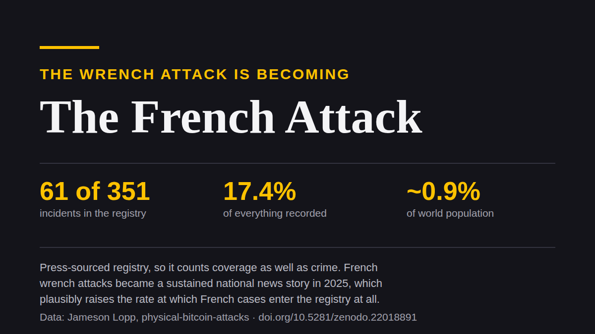

# The (F/W)rench Attack

Si tienes bitcoin en Francia y lo declaras, estás en una base de datos. En junio
de 2025 una empleada de la administración tributaria quedó detenida, acusada de
consultar esa base para el crimen organizado. Los investigadores reportaron que
las consultas cubrían, entre otros, a personas que habían declarado ganancias en
criptomonedas.

Francia es también donde el ataque de la llave inglesa se volvió tema nacional, y
este texto trata de la conexión entre esos dos hechos.

## Una base de datos, consultada

### Lo que dice la investigación

Lo reportado describe a una agente en Île-de-France consultando Mira, un sistema
interno del fisco con expedientes sensibles, sin razón profesional para estar
ahí. Los resultados, domicilios y situaciones financieras, habrían llegado a un
contacto ligado al crimen organizado. El pago habría sido por Western Union.

Está detenida desde el 30 de junio de 2025, bajo investigación por asociación
delictuosa y complicidad en un ataque contra un custodio penitenciario. En una
audiencia habría admitido los hechos y se negó a decir quién daba las órdenes. El
proceso está abierto y nada de esto es una sentencia.

La parte que debería molestarte no es ninguna de esas.

### Cómo salió a la luz, y por qué eso es lo peor

El caso salió porque uno de los domicilios que pasó era el de un custodio
penitenciario, y a ese custodio lo atacaron. Alguien jaló ese hilo y encontró
todo lo demás al final.

O sea que el lado cripto no se descubrió porque una víctima cripto denunciara un
asalto y un investigador reconstruyera hacia atrás. Se descubrió por accidente,
a partir de otro delito, contra otro tipo de objetivo. Queda entonces una
pregunta que nadie puede contestar: ¿cuántas consultas no dejaron ningún hilo que
jalar?

No "probablemente muchas". Incognoscible. Esa es la respuesta honesta y es peor
que cualquier número grande.

## La versión más fuerte del consejo, tomada en serio

Siempre hay alguien que dice, por acá: bueno, entonces no generes el registro.
Compra sin KYC. No declares nada. No dejes rastro.

Eso merece tomarse en serio en vez de descartarse, porque como higiene personal
es correcto. Menos registros le gana a más registros. Si nunca has estado en una
base de datos tienes menos de qué preocuparte que quien sí.

Tres cosas impiden que sea un mecanismo de seguridad.

## La exposición es un trinquete

La primera es que solo paga por adelantado.

Un registro no se puede descrear. Una filtración no se puede desfiltrar. Lo que
el exchange supo de ti en 2019 lo sabe para siempre, y también lo sabe quien haya
obtenido después lo que él sabía. Lo que declaraste está en Mira.

Lo cual quiere decir que la economía te corre en contra desde las dos direcciones
a la vez. Mantenerte privado se acumula en costo: cada año que sostienes, cada
contraparte con la que tratas, cada servicio que ahora quiere un documento. Y se
deprecia en valor, porque tu discreción vale algo solo si nadie te publicó ya.

Pagas más cada año por algo que vale menos cada año. Eso no es una defensa
teniendo un mal año. Es una defensa con dirección.

Contra un ataque de la llave inglesa que Francia volvió ordinario, esa dirección
es todo el problema: los más expuestos son los que llevan más tiempo
sosteniendo.

## Un delito, o un archivo que se peina

La segunda es más simple y, para la mayoría, lo zanja.

Donde las ganancias o las tenencias son legalmente declarables, "no dejes
registro" no es discreción. Es omisión de declaración, que es un delito.

Tomado al pie de la letra, entonces, el consejo es una instrucción que quien
cumple la ley no tiene permitido seguir. Puedes estar en regla o puedes ser
invisible. Escoge una.

Y el consuelo de siempre, que al menos la copia del Estado está a salvo, es
justamente de lo que trata este caso. El tenedor francés cumplido hizo todo bien,
declaró sus ganancias como se le pidió, y terminó en un expediente que
presuntamente se consultaba por encargo para gente que quería saber dónde vivía.

### Una oficina honesta, una empleada deshonesta

Quiero ser preciso con el blanco. Esta no es una historia sobre una
administración tributaria corrupta. Hasta donde va lo reportado es una empleada,
y el caso se está procesando, que es el sistema haciendo su trabajo. Ese es el
punto. Una oficina de impuestos perfectamente honesta con una empleada deshonesta
produce el mismo resultado para el tenedor. El hecho estructural no es la
traición. Es que existe una lista consultable de personas que tienen bitcoin, y
que siga cerrada depende de la integridad de todos los que alguna vez tuvieron
acceso a ella, para siempre.

## La discreción nunca fue un mecanismo

La tercera razón vuelve casi redundantes a las otras dos, y tiene un siglo.

El principio de Kerckhoffs: supón que el atacante conoce el sistema. Todo excepto
la llave es público. Un diseño se juzga por cómo se comporta frente a un
adversario que conoce tu situación, porque tarde o temprano alguno la conoce.

La discreción falla eso por construcción: es una esperanza sobre la ignorancia
del atacante, no un mecanismo. [*The Denial Spiral*](https://zenodo.org/doi/10.5281/zenodo.22778480) clasifica así a la
categoría entera que se vende, con la documentación de los propios fabricantes. Y
[*The Deadly Race*](https://zenodo.org/doi/10.5281/zenodo.22018891) es lo que esa esperanza te cuesta cuando resulta
equivocada y tú eres quien está en el cuarto.

## El ataque de la llave inglesa, y el ataque francés

El señor de la llave inglesa de allá arriba es el chiste del título. Prefiero
explicarlo a dejarlo ahí sentado, satisfecho consigo mismo.

### La desproporción, y de qué está hecha

Francia concentra 61 de los 351 incidentes del registro público de ataques
físicos a tenedores de bitcoin que mantiene Jameson Lopp. Eso es 17.4% de todo lo
registrado en el mundo, desde un país con alrededor de 0.9% de la población
mundial. En 2026 concentra algo así como dos tercios de todo lo que el registro
anotó.

El ataque de la llave inglesa se está volviendo el ataque francés.

Y esto es lo que tiene que viajar junto con esa frase. Es una afirmación sobre lo
que queda registrado al menos tanto como sobre lo que ocurre. El registro se
construye con notas de prensa. Los ataques de la llave inglesa en Francia se
volvieron tema nacional sostenido en 2025, lo que plausiblemente eleva la tasa a
la que los casos franceses entran al registro siquiera, con independencia de
cuántos ocurran. Un país cuya prensa cubre esto con intensidad se ve peor que uno
cuya prensa no lo hace, y parte de esa brecha es periodismo y no delito.

### Lo que los datos no resuelven

Así que Francia domina lo que queda registrado. Cuánto de eso es incidencia y
cuánto es visibilidad es exactamente la pregunta que podría contestar alguien con
datos franceses no públicos y que este conjunto no puede. Si ese eres tú, me
gustaría que me escribieras.

Lo que no está en duda es la forma. Bandas organizadas, trabajo de
reconocimiento, blancos escogidos de listas. Incluyendo aquí una lista que el
Estado llevaba porque la ley se lo mandaba.

El consejo dice mantén un perfil bajo. La ley dice declara tus ganancias.
Escoge una.

El expediente dice que ya sabe.

---

*Hay dos papers detrás de esto.* [***The Denial Spiral***](https://zenodo.org/doi/10.5281/zenodo.22778480)
*clasifica las defensas que se apoyan en la ignorancia del atacante, y muestra por
qué el consejo empeora para todos mientras más gente lo sigue.*
[***The Deadly Race***](https://zenodo.org/doi/10.5281/zenodo.22018891) *es lo que te cuesta
cuando una de ellas falla: un decomiso que deja un camino viable pero inconcluso
convierte un robo en una carrera, y le pone precio a tu eliminación. Los dos
gratis, sin registro.*

*Datos de incidentes del* [*registro de Jameson Lopp*](https://github.com/jlopp/physical-bitcoin-attacks)*,
una muestra de prensa: se le escapa lo no reportado y sobrepondera lo que llegó a
las noticias. Los casos nuevos que encuentro van allá y no a una base de datos
mía, lo cual en un texto sobre bases de datos parece valer la pena decirlo en voz
alta.*

---

**Si valió tu tiempo.** Mándaselo a alguien que todavía crea que el silencio es un
plan. Una ⭐ en [Great Wall](https://github.com/Yuri-SVB/Great-Wallet),
[la investigación](https://github.com/Yuri-SVB/great-wall-docs) o
[estos textos](https://github.com/Yuri-SVB/great-wall-posts) no cuesta nada y hace
más fácil encontrar el trabajo. Y si quieres financiarlo,
[support](https://github.com/Yuri-SVB/support) acepta ⚡ Lightning y on-chain, sin
registro, sin niveles, sin esperar nada de vuelta.
