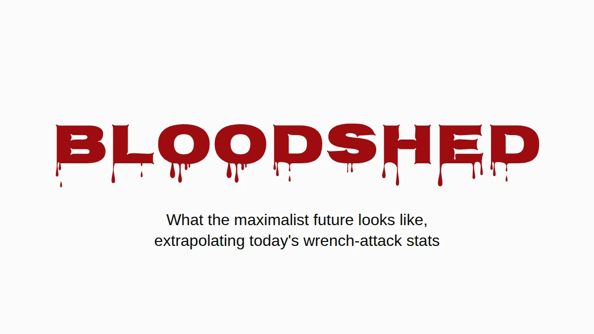

# Bloodshed

Suppose the maximalists win. Not the price-target version, the real one:
bitcoin is where people keep their wealth, and they keep it the way the
community tells them to, in their own custody, at home. I'd like that world
to exist. So it seems worth asking what it looks like when you run today's
wrench attack numbers through it.

The short answer is that England and Wales would end up burying people at
about the rate Ukraine buried civilians in 2025, from burglaries that already
happen today. The longer answer has caveats, and all of them are below, but
none of them makes the problem go away.

## One wrench attack in twenty-two

Jameson Lopp keeps a [public registry](https://github.com/jlopp/physical-bitcoin-attacks) of physical attacks on crypto holders.
It's the best record there is, and it's a press-sourced sample, so it misses
whatever never made the news. I went through all 351 distinct incidents in it
and read every headline that mentioned a death. The keyword search the
published figure rests on catches a few wrong rows (a town called Killingly,
two attackers shot by police, a killing that was only planned) and misses a
few real ones ("beaten to death" doesn't match "killed").

Counted by hand: **16 victims dead in 351 incidents, 4.6%.** With a sample
this size the honest range is roughly 2.8% to 7.3%. About one wrench attack
in twenty-two ends with someone dead.

That's a floor, and not for the usual reason. When a bitcoin holder is
murdered, the people who mourn them are very often the people who now hold
their keys. Telling the police, or a reporter, that the victim had bitcoin
announces that someone in the house has it now. So the killings least likely
to be recorded as bitcoin attacks are exactly the ones where the coins
survived. Nobody can put a number on how many there are, and that's rather
the point. The [Denial Spiral](https://zenodo.org/doi/10.5281/zenodo.22778480) goes
into why this kind of blind spot doesn't correct itself.

The same silence works on the other side of the fraction, though. Holders
who survive an attack have just as much reason not to tell anyone what they
held, so the non-fatal cases are undercounted too. Hidden killings push the
true share up and hidden survivals push it down, and nobody can say which is
bigger. So I take 4.6% at face value, and it holds up whether you read it
cautiously or aggressively.

## Only when someone's home

Most burglaries aren't wrench attacks. Someone breaks in while you're at work
and leaves with the laptop, and in a bitcoin world a seed phrase stamped into
a steel plate in the drawer would go the same way. Take the plate, take the
coins, nobody gets hurt. In the terms of the
[Deadly Race](https://zenodo.org/doi/10.5281/zenodo.22018891), that's a clear
success for the thief, with no reason to come back. So leave empty houses
out of it entirely.

That still leaves the burglaries where someone is home. They happen now, in
large numbers, and in England and Wales they're [over half of all domestic
burglaries](https://www.ons.gov.uk/peoplepopulationandcommunity/crimeandjustice/articles/overviewofburglaryandotherhouseholdtheft/latest)
where the burglar gets in. Today the person in the house is an obstacle
between a thief and the television. Under the maximalist premise the person
in the house *is* the safe: the wealth is behind a PIN, a passphrase, a
memory, and they're standing right there. That's a wrench attack, and wrench
attacks end in a death at least one time in twenty-two.

## The arithmetic

Take each country's police-recorded home burglaries, keep only the share
with someone home, and multiply by 4.6%. No baseline, no conversion of empty
houses, nothing assumed about which advice people follow. Just the extra
deaths.

The black lines on the chart, and the range column below, show where each
figure lands if the true death share is anywhere from 2.8% to 7.3%.

| Extra deaths per 100,000 a year | Estimate | Range |
|---|---:|---:|
| England & Wales (half of burglaries with someone home) | **6.2** | 3.8–9.8 |
| United States (28% with someone home) | 1.5 | 0.9–2.4 |
| **Ukraine, civilians killed in the war, 2025** | **6.6–7.6** | |

England and Wales land in the same range as a country at war: 6.2 extra
deaths per 100,000 a year, against 6.6 to 7.6 civilians killed in Ukraine in
2025, [the deadliest year for civilians since 2022](https://ukraine.un.org/en/308241-2025-deadliest-year-civilians-ukraine-2022-un-human-rights-monitors-find).
The Ukrainian figure is UN-verified civilian deaths only, no soldiers, and
the UN says it's well below the real toll. It's the most conservative war
number there is.

The US comes out lower, about a quarter of that, mostly because far fewer
American burglaries happen with someone home ([28%](https://bjs.ojp.gov/press-release/victimization-during-household-burglary)).
France and Germany don't publish the share, so they're not on the chart.

Everything here is a conditional extrapolation, not a forecast. I used
police-recorded burglaries, which undercount; the crime surveys put the real
number considerably higher. The death rate comes from attacks the press
chose to report, which probably pushes it up. And the whole thing rests on
one assumption, which I'd rather name than hide: that a burglar who finds
the holder of a bitcoin fortune at home behaves like a wrench attacker. The
registry is 351 cases of what that behavior looks like.

It isn't getting less lethal, either. The share of recorded attacks ending in
a death has held at 4–5% across the registry's history (4.1% to 2020, 4.1%
for 2021–23, 5.0% since 2024), while the number of attacks per year has
roughly doubled. Same odds, more rolls.

## Where it's already happening

Everything above is about a future where everyone holds. What follows is
about the people who hold now, and it's the same risk seen from the other end:
the burglary arithmetic is what this becomes once the whole population is in
the denominator.

None of this needs a hypothetical future in France. France has the most
entries in the registry, and what sets it apart is the method: 57% of French
incidents are kidnappings or hostage-takings by headline, against roughly
35–40% worldwide, and nine of the twelve cases where attackers seized a relative
instead of the holder are French.

The [national organized-crime prosecutor](https://www.franceinfo.fr/economie/bitcoin/cryptomonnaies-plus-de-70-enlevements-et-sequestrations-recenses-sur-les-huit-premiers-mois-de-2026-d-apres-le-parquet-national-anticriminalite-organisee_8188352.html) counted about twenty crypto-related
kidnappings or sequestrations in 2024, **67 in 2025**, and more than seventy
in the first eight months of 2026. Spread across France's five and a half
to six million crypto holders (10–11% of adults, by the industry's own
surveys, [2025](https://www.presse-citron.net/age-revenus-placements-4-choses-a-savoir-sur-les-francais-qui-investissent-dans-les-cryptos/) and [2026](https://journalducoin.com/actualites/adoption-crypto-france-adan-barometre/)), that's about 1.2 per 100,000 holders in 2025 and 1.8 at this year's
pace.

Nigeria, tragically infamous for kidnappings, had about 3.4 abductions per 100,000 people in the year to June 2026, by
the [press count](https://www.ripplesnigeria.com/kidnap-economy-report-says-criminals-made-over-n7-8bn-from-ransoms-in-one-year/) most people cite. Both numbers are reported cases, both are
undercounts, and Nigeria's reputation was built on the reported ones too.

So the average French holder is still safer than the average Nigerian. But
that average includes everyone with fifty euros in an app, and nobody kidnaps
them. Four French holders in five have less than €5,000. Attackers pick visible wealth, so the fair comparison is with the people
they pick, and that one can be bounded without guessing anything.

The same survey puts the total French holding at €21–26 billion, and that
one number caps every wealth bracket. France can't contain more than about
26,000 people with a million euros or more in crypto, because if there were
more, they'd own more than all of it. At half a million the cap is about
52,000; at €100,000, about 262,000. Each cap is absurdly generous, since it
leaves nothing at all for the other five and a half million holders, and a
larger denominator only makes the rate smaller.

For the numerator I took only the French cases, January 2025 to August 2026,
where the press reported how much the victim's household actually had:

- the father of a "crypto millionaire", held for a €5 million ransom and
  mutilated before police freed him (Paris, May 2025);
- a crypto industry worker robbed of €2 million in bitcoin (Paris, August
  2025);
- a retired couple kidnapped for their son's €8 million (Sallanches, January
  2026);
- a couple robbed of €900,000 by men posing as police (Le Chesnay, March 2026);
- a family of five held hostage until they transferred €700,000 (Ploudalmézeau,
  April 2026).

Everyone else is counted as a sardine, including David Balland, the Ledger
co-founder taken in January 2025 for a [ransom reported](https://www.frenchweb.fr/david-balland-cofondateur-de-ledger-kidnappe-et-libere-apres-une-demande-de-rancon/450873) at €5–10 million,
because what he personally held was never published. Divide, and annualize:

| Crypto held | At most this many in France | Kidnapped, per 100,000 a year, at least | vs Nigeria (3.4) | vs Haiti (5.5) |
|---|---:|---:|---:|---:|
| €250,000+ | 105,000 | 2.9 | 0.8× | 0.5× |
| €500,000+ | 52,000 | 5.7 | **1.7×** | 1.0× |
| €1 million+ | 26,000 | 6.9 | **2.0×** | **1.3×** |
| €2 million+ | 13,000 | 9.2 | **2.7×** | **1.7×** |
| €5 million+ | 5,000 | 11.4 | **3.4×** | **2.1×** |

The rate climbs with every rung, which is what targeting looks like from the
outside. From about a third of a million euros up, the floor alone beats
Nigeria.

It's a floor built on a ceiling: a handful of the known cases over the
largest population the arithmetic allows. Most victims' holdings are never
reported at all, so every row is an undercount, and the top rows rest on one
or two cases each. Count Balland and the top row doubles.

How loose is the ceiling? Wealth at the top follows a steep power law, which
means the real number of French crypto millionaires is far below 26,000, not
near it. A less extreme guess: give France its ordinary share of the world's
millionaires, a little over 4% (2.4 million of 57.5 million, by
[UBS](https://www.visualcapitalist.com/ranked-countries-with-the-most-millionaires-in-2026/)),
and apply it to the roughly 242,000 crypto millionaires worldwide
([Henley & Partners](https://www.henleyglobal.com/newsroom/press-releases/crypto-wealth-report-2025)).
That's about 10,000 people, and a kidnapping rate for them of about **18 per
100,000 a year, more than five times the Nigerian figure**. That one is an estimate, not
a floor; the table is the floor.

**A French household with half a million euros in crypto is more likely to
have someone kidnapped than an ordinary Nigerian, counted the same way
Nigeria's reputation is.**

Haiti, a tragically collapsed nation, had at least 647 documented
kidnappings in 2025 by the [UN mission's](https://binuh.unmissions.org/sites/default/files/2026-01/Quarterly%20Report%20on%20the%20human%20rights%20situation%20in%20Haiti%20%28October%20-%20December%202025%29%20-%20ENGLISH_0.pdf) own case-by-case count, which it calls a
minimum: at least 5.5 per 100,000 people. From about a million euros in
crypto up, the French floor is higher than that too.

If this year's growth holds, French holders as a whole, sardines included,
reach Nigeria's current rate around 2028.

It hasn't slowed down. [In September](https://cryptoast.fr/crypto-rapts-france-recap-nice-rennes-septembre-2026/) a mother and her son were held at home
in Nice by two masked men over a $25,000 account, and a family near Rennes
was attacked in August by a crew who had the wrong house.

## It changes when it hurts

People don't redesign their security because an argument is good. They do it
when the cost of not doing it becomes impossible to ignore. When
[Coldcard's randomness bug](https://github.com/Yuri-SVB/great-wall-posts/tree/main/posts/010-hot-takeaways-of-the-coldcard-hack)
went public, the community's guidance moved within days to rolling fifty dice
by hand, a procedure that would have been dismissed as paranoid a month
earlier. Effort tolerance isn't fixed. It moves when the threat becomes
legible.

The threat here is legible now, at least in France. What the change has to
achieve is the criterion from [the Deadly Race](https://github.com/Yuri-SVB/great-wall-posts/tree/main/posts/006-the-deadly-race):
after an attacker has you and everything you own, the attack has to clearly
end, either because he has it or because there is nothing left for him to
get. What it can't do is leave a path that only you can finish, because that
path makes you his competitor, and the paper is about what happens to
competitors.

Great Wall is one construction built to clear that bar, and the paper
explains how. It won't be the last, and it doesn't need to be the one you
pick. The maximalist future needs *some* custody that clears it, or it's going
to look a lot like the chart.

---

*The criterion and why a partial seizure prices the holder's life are in*
[***The Deadly Race***](https://zenodo.org/doi/10.5281/zenodo.22018891)*. Why denial,
decoys and discretion wear out, and why the record undercounts, is in*
[***The Denial Spiral***](https://zenodo.org/doi/10.5281/zenodo.22778480)*. Both open
access, no signup.*

*Incident data from* [*Jameson Lopp's registry*](https://github.com/jlopp/physical-bitcoin-attacks)*,
snapshot of 13 August 2026. Burglary counts:* [*SSMSI*](https://www.interieur.gouv.fr/Interstats/Actualites/Insecurite-et-delinquance-en-2025-bilan-statistique-et-atlas-departemental) *(France,
2025),* [*ONS*](https://www.gov.uk/government/statistics/crime-in-england-and-wales-year-ending-march-2025) *(England & Wales, year to March 2025),*
[*FBI*](https://cde.ucr.cjis.gov/) *(US, 2024),* [*PKS*](https://www.bundesregierung.de/breg-de/aktuelles/polizeiliche-kriminalstatistik-2025-2422020) *(Germany, 2025). Homicide:*
[*SSMSI*](https://www.interieur.gouv.fr/Interstats/Infractions-et-sentiment-d-insecurite/Homicides-et-tentatives-d-homicides)*,* [*ONS*](https://www.ons.gov.uk/peoplepopulationandcommunity/crimeandjustice/articles/homicideinenglandandwales/yearendingmarch2025)*,* [*FBI*](https://cde.ucr.cjis.gov/)*,*
[*UNODC*](https://data.worldbank.org/indicator/VC.IHR.PSRC.P5?locations=DE-UA)*. Burglaries with someone home:* [*BJS*](https://bjs.ojp.gov/press-release/victimization-during-household-burglary)*,*
[*ONS*](https://www.ons.gov.uk/peoplepopulationandcommunity/crimeandjustice/articles/overviewofburglaryandotherhouseholdtheft/latest)*. Ukraine:* [*OHCHR*](https://ukraine.un.org/en/308241-2025-deadliest-year-civilians-ukraine-2022-un-human-rights-monitors-find) *2025. French
kidnappings:* [*PNACO*](https://www.franceinfo.fr/economie/bitcoin/cryptomonnaies-plus-de-70-enlevements-et-sequestrations-recenses-sur-les-huit-premiers-mois-de-2026-d-apres-le-parquet-national-anticriminalite-organisee_8188352.html)*. Haiti:* [*BINUH*](https://binuh.unmissions.org/sites/default/files/2026-01/Quarterly%20Report%20on%20the%20human%20rights%20situation%20in%20Haiti%20%28October%20-%20December%202025%29%20-%20ENGLISH_0.pdf) *2025.
Nigeria:* [*SBM Intelligence*](https://www.ripplesnigeria.com/kidnap-economy-report-says-criminals-made-over-n7-8bn-from-ransoms-in-one-year/)*, July 2025 to June 2026. Holders
and total held:* [*ADAN/Deloitte/Ipsos 2025*](https://www.presse-citron.net/age-revenus-placements-4-choses-a-savoir-sur-les-francais-qui-investissent-dans-les-cryptos/)*,*
[*ADAN 2026*](https://journalducoin.com/actualites/adoption-crypto-france-adan-barometre/)*.*

---

**If this was worth your time.** Send it to whoever talked you into your current
setup. A ⭐ on [Great Wall](https://github.com/Yuri-SVB/Great-Wallet),
[the research](https://github.com/Yuri-SVB/great-wall-docs) or
[these posts](https://github.com/Yuri-SVB/great-wall-posts) costs nothing and
makes the work easier to find. And if you want to fund it,
[support](https://github.com/Yuri-SVB/support) takes ⚡ Lightning and on-chain, no
signup, no tiers, nothing expected back.
