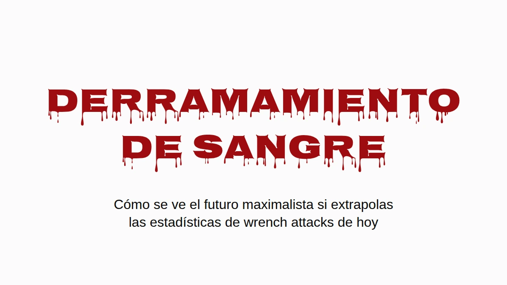

# Derramamiento de sangre

Supón que ganan los maximalistas. No la versión del precio objetivo, la de
verdad: bitcoin es donde la gente guarda su patrimonio, y lo guarda como la
comunidad le dice, en autocustodia, en su casa. A mí me gustaría que ese mundo
existiera. Por eso vale la pena preguntarse cómo se ve cuando le metes los
números de wrench attacks de hoy.

La respuesta corta es que Inglaterra y Gales acabarían enterrando gente más o
menos al ritmo al que Ucrania enterró civiles en 2025, por robos que ya pasan
hoy. La respuesta larga trae salvedades, y están todas abajo, pero ninguna hace
que el problema desaparezca.

## Un wrench attack de cada veintidós

Jameson Lopp lleva un [registro público](https://github.com/jlopp/physical-bitcoin-attacks) de ataques físicos contra poseedores de cripto.
Es el mejor registro que existe, y es una muestra sacada de la prensa, así que
se le escapa todo lo que nunca salió en las noticias. Revisé los 351 incidentes
distintos que tiene y leí cada titular que mencionaba una muerte. La búsqueda
por palabra clave en la que se apoya la cifra publicada atrapa algunas filas
equivocadas (un pueblo llamado Killingly, dos atacantes abatidos por la
policía, un asesinato que solo estaba planeado) y se le pasan algunas reales
("beaten to death" no coincide con "killed").

Contadas a mano: **16 víctimas muertas en 351 incidentes, 4.6%.** Con una
muestra de este tamaño, el rango honesto va más o menos de 2.8% a 7.3%. Como
uno de cada veintidós wrench attacks termina con alguien muerto.

Eso es un piso, y no por la razón de siempre. Cuando matan a un poseedor de
bitcoin, quienes lo lloran muchas veces son los que ahora tienen sus llaves.
Decirle a la policía, o a un periodista, que la víctima tenía bitcoin es
anunciar que alguien en esa casa lo tiene ahora. Así que los asesinatos con
menos probabilidad de quedar registrados como ataques por bitcoin son
justamente aquellos en los que las monedas sobrevivieron. Nadie puede ponerle
número a cuántos son, y de eso se trata un poco.
[The Denial Spiral](https://zenodo.org/doi/10.5281/zenodo.22778480) explica por qué este
tipo de punto ciego no se corrige solo.

El mismo silencio opera también del otro lado de la fracción, eso sí. Quien
sobrevive a un ataque tiene exactamente los mismos motivos para no contarle a
nadie lo que tenía, así que los casos no fatales también están subcontados.
Los asesinatos ocultos empujan la proporción real hacia arriba y las
supervivencias ocultas la empujan hacia abajo, y nadie sabe cuál pesa más. Por
eso tomo el 4.6% tal cual, y aguanta tanto si lo lees con cautela como si lo
lees con agresividad.

## Solo cuando hay alguien en casa

La mayoría de los robos a casa no son wrench attacks. Alguien se mete mientras
estás en el trabajo y se va con la laptop, y en un mundo bitcoin una semilla
grabada en una placa de acero en el cajón correría la misma suerte. Se lleva la
placa, se lleva las monedas, nadie sale lastimado. En los términos de
[The Deadly Race](https://zenodo.org/doi/10.5281/zenodo.22018891), eso es un éxito claro
para el ladrón, sin ningún motivo para regresar. Así que deja fuera las casas
vacías por completo.

Aun así quedan los robos con alguien adentro. Pasan hoy, en cantidades
grandes, y en Inglaterra y Gales son [más de la mitad de los robos a casa
habitación](https://www.ons.gov.uk/peoplepopulationandcommunity/crimeandjustice/articles/overviewofburglaryandotherhouseholdtheft/latest)
en los que el ladrón logra entrar. Hoy la persona en la casa es un estorbo
entre el ladrón y la tele. Con la premisa maximalista, la persona en la casa
*es* la caja fuerte: el patrimonio está detrás de un PIN, una passphrase, un
recuerdo, y ella está parada ahí mismo. Eso es un wrench attack, y los wrench
attacks terminan en una muerte al menos una vez de cada veintidós.

## La aritmética

Toma los robos a casa registrados por la policía en cada país, quédate solo
con la parte en la que había alguien, y multiplica por 4.6%. Sin línea base,
sin convertir casas vacías, sin suponer nada sobre qué consejos sigue la
gente. Nada más las muertes adicionales.

Las líneas negras de la gráfica, y la columna de rango de abajo, muestran
dónde cae cada cifra si la proporción real de muertes está en cualquier punto
entre 2.8% y 7.3%.

| Muertes adicionales por cada 100,000 al año | Estimación | Rango |
|---|---:|---:|
| Inglaterra y Gales (la mitad de los robos con alguien en casa) | **6.2** | 3.8–9.8 |
| Estados Unidos (28% con alguien en casa) | 1.5 | 0.9–2.4 |
| **Ucrania, civiles muertos en la guerra, 2025** | **6.6–7.6** | |

Inglaterra y Gales caen en el mismo rango que un país en guerra: 6.2 muertes
adicionales por cada 100,000 al año, contra 6.6 a 7.6 civiles muertos en
Ucrania en 2025, [el año más letal para los civiles desde 2022](https://ukraine.un.org/en/308241-2025-deadliest-year-civilians-ukraine-2022-un-human-rights-monitors-find).
La cifra ucraniana son solo muertes de civiles verificadas por la ONU, sin
soldados, y la propia ONU dice que se queda muy por debajo del saldo real. Es
el número de guerra más conservador que hay.

Estados Unidos sale más bajo, como la cuarta parte, sobre todo porque muchos
menos robos allá pasan con alguien en casa ([28%](https://bjs.ojp.gov/press-release/victimization-during-household-burglary)).
Francia y Alemania no publican esa proporción, así que no están en la gráfica.

Todo esto es una extrapolación condicional y no un pronóstico. Usé robos
registrados por la policía, que se quedan cortos; las encuestas de
victimización ponen el número real bastante más arriba. La tasa de muertes
sale de ataques que la prensa decidió reportar, lo cual probablemente la
infla. Y todo descansa en un supuesto, que prefiero nombrar a esconder: que un
ladrón que encuentra en casa al dueño de una fortuna en bitcoin se comporta
como el autor de un wrench attack. El registro son 351 casos de cómo se ve ese
comportamiento.

Tampoco se está volviendo menos letal. La proporción de ataques registrados
que terminan en una muerte se ha mantenido en 4–5% a lo largo de la historia
del registro (4.1% hasta 2020, 4.1% en 2021–23, 5.0% desde 2024), mientras el
número de ataques por año más o menos se duplicó. Mismas probabilidades, más
tiradas.

## Donde ya está pasando

Todo lo anterior trata de un futuro en el que todo el mundo tiene bitcoin. Lo
que sigue trata de la gente que lo tiene ahora, y es el mismo riesgo visto
desde la otra punta: la aritmética de los robos es en lo que esto se convierte
cuando toda la población entra en el denominador.

En Francia nada de esto necesita un futuro hipotético. Francia es el país con
más entradas en el registro, y lo que la distingue es el método: 57% de los
incidentes franceses son secuestros o tomas de rehenes según el titular,
contra más o menos 35–40% en el mundo, y nueve de los doce casos en los que
los atacantes se llevaron a un familiar en lugar del poseedor son franceses.

La [fiscalía nacional contra el crimen organizado](https://www.franceinfo.fr/economie/bitcoin/cryptomonnaies-plus-de-70-enlevements-et-sequestrations-recenses-sur-les-huit-premiers-mois-de-2026-d-apres-le-parquet-national-anticriminalite-organisee_8188352.html) contó unos veinte secuestros
o privaciones de la libertad ligados a cripto en 2024, **67 en 2025**, y más de
setenta en los primeros ocho meses de 2026. Repartidos entre los cinco millones
y medio a seis millones de poseedores de cripto en Francia (10–11% de los
adultos, según las encuestas de la propia industria, [2025](https://www.presse-citron.net/age-revenus-placements-4-choses-a-savoir-sur-les-francais-qui-investissent-dans-les-cryptos/) y [2026](https://journalducoin.com/actualites/adoption-crypto-france-adan-barometre/)), da como 1.2 por cada 100,000 poseedores en 2025 y 1.8 al ritmo de
este año.

Nigeria, trágicamente famosa por los secuestros, tuvo unos 3.4 secuestros por cada 100,000 habitantes en el año a junio de 2026, según
el [conteo de prensa](https://www.ripplesnigeria.com/kidnap-economy-report-says-criminals-made-over-n7-8bn-from-ransoms-in-one-year/) que casi todos citan. Los dos números son casos reportados, los dos
se quedan cortos, y la fama de Nigeria también se construyó con los reportados.

O sea que el poseedor francés promedio todavía está más seguro que el
nigeriano promedio. Pero ese promedio incluye a todos los que tienen cincuenta
euros en una app, y a esos nadie los secuestra. Cuatro de cada cinco
poseedores franceses tienen menos de €5,000. Los atacantes eligen riqueza visible, así que la comparación justa es con la gente
que eligen, y a esa se le puede poner cota sin adivinar nada.

La misma encuesta pone el total en manos francesas en €21–26 mil millones, y
ese único número topa cada rango de patrimonio. En Francia no puede haber más
de unas 26,000 personas con un millón de euros o más en cripto, porque si
hubiera más, tendrían más que el total. Con medio millón el tope es de unas
52,000; con €100,000, unas 262,000. Cada tope es absurdamente generoso, porque
no le deja nada a los otros cinco millones y medio de poseedores, y un
denominador más grande solo hace más chica la tasa.

Para el numerador tomé solo los casos franceses, de enero de 2025 a agosto de
2026, en los que la prensa reportó cuánto tenía de verdad el hogar de la
víctima:

- el padre de un "millonario cripto", retenido por un rescate de €5 millones y
  mutilado antes de que la policía lo liberara (París, mayo de 2025);
- un trabajador de la industria cripto al que le robaron €2 millones en bitcoin
  (París, agosto de 2025);
- una pareja de jubilados secuestrada por los €8 millones de su hijo
  (Sallanches, enero de 2026);
- una pareja a la que le robaron €900,000 unos tipos que se hicieron pasar por
  policías (Le Chesnay, marzo de 2026);
- una familia de cinco retenida como rehén hasta que transfirió €700,000
  (Ploudalmézeau, abril de 2026).

Todos los demás cuentan como sardinas, incluido David Balland, el cofundador de
Ledger secuestrado en enero de 2025 por un [rescate que se reportó](https://www.frenchweb.fr/david-balland-cofondateur-de-ledger-kidnappe-et-libere-apres-une-demande-de-rancon/450873) de €5–10 millones,
porque lo que él tenía personalmente nunca se publicó. Divide y anualiza:

| Cripto en su poder | Como máximo esta gente en Francia | Secuestrados, por cada 100,000 al año, al menos | vs Nigeria (3.4) | vs Haití (5.5) |
|---|---:|---:|---:|---:|
| €250,000+ | 105,000 | 2.9 | 0.8× | 0.5× |
| €500,000+ | 52,000 | 5.7 | **1.7×** | 1.0× |
| €1 millón+ | 26,000 | 6.9 | **2.0×** | **1.3×** |
| €2 millones+ | 13,000 | 9.2 | **2.7×** | **1.7×** |
| €5 millones+ | 5,000 | 11.4 | **3.4×** | **2.1×** |

La tasa sube en cada escalón, que es como se ve la selección de objetivos
desde afuera. De más o menos un tercio de millón de euros para arriba, el puro
piso ya le gana a Nigeria.

Es un piso construido sobre un techo: un puñado de los casos conocidos sobre
la población más grande que la aritmética permite. La mayoría de las víctimas
nunca reporta lo que tenía, así que cada fila se queda corta, y las filas de
arriba descansan en uno o dos casos cada una. Cuenta a Balland y la fila de
arriba se duplica.

¿Qué tan holgado es el techo? La riqueza en la cima sigue una ley de potencias
muy empinada, lo que quiere decir que el número real de millonarios cripto en
Francia está muy por debajo de 26,000, no cerca. Una suposición menos extrema:
dale a Francia su proporción normal de los millonarios del mundo, poco más de
4% (2.4 millones de 57.5 millones, según
[UBS](https://www.visualcapitalist.com/ranked-countries-with-the-most-millionaires-in-2026/)),
y aplícala a los aproximadamente 242,000 millonarios cripto del mundo
([Henley & Partners](https://www.henleyglobal.com/newsroom/press-releases/crypto-wealth-report-2025)).
Salen unas 10,000 personas, y una tasa de secuestro para ellas de unos **18 por
cada 100,000 al año, más de cinco veces la cifra nigeriana**. Ojo, eso ya es
una estimación; el piso es la tabla.

**Un hogar francés con medio millón de euros en cripto tiene más probabilidades
de que le secuestren a alguien que un nigeriano cualquiera, contado de la misma
forma con la que se hizo la fama de Nigeria.**

Haití, una nación trágicamente colapsada, tuvo al menos 647 secuestros
documentados en 2025 según el conteo caso por caso de la [misión de la ONU](https://binuh.unmissions.org/sites/default/files/2026-01/Quarterly%20Report%20on%20the%20human%20rights%20situation%20in%20Haiti%20%28October%20-%20December%202025%29%20-%20ENGLISH_0.pdf), que ella misma llama un
mínimo: al menos 5.5 por cada 100,000 habitantes. De como un millón de euros
en cripto para arriba, el piso francés también supera eso.

Si el crecimiento de este año se sostiene, los poseedores franceses en su
conjunto, sardinas incluidas, alcanzan la tasa actual de Nigeria alrededor de
2028.

Y no ha bajado el ritmo. [En septiembre](https://cryptoast.fr/crypto-rapts-france-recap-nice-rennes-septembre-2026/) dos hombres enmascarados retuvieron en su casa
de Niza a una madre y a su hijo por una cuenta de $25,000, y en agosto una
familia cerca de Rennes fue atacada por una banda que se equivocó de casa.

## Cambia cuando duele

La gente no rediseña su seguridad porque un argumento sea bueno. Lo hace
cuando el costo de no hacerlo ya no se puede ignorar. Cuando se hizo público
[el bug de aleatoriedad de Coldcard](https://github.com/Yuri-SVB/great-wall-posts/tree/main/posts/010-hot-takeaways-of-the-coldcard-hack),
las recomendaciones de la comunidad pasaron en días a tirar cincuenta dados a
mano, un procedimiento que un mes antes se habría despachado como paranoia.
La tolerancia al esfuerzo no es fija. Se mueve cuando la amenaza se vuelve
legible.

Aquí la amenaza ya es legible, al menos en Francia. Lo que el cambio tiene que
lograr es el criterio de [la carrera mortal](https://github.com/Yuri-SVB/great-wall-posts/tree/main/posts/006-the-deadly-race):
una vez que el atacante te tiene a ti y todo lo que posees, el ataque tiene que
terminar claramente, o porque ya lo tiene o porque no queda nada más que
sacar. Lo que no puede hacer es dejar un camino que solo tú puedes terminar,
porque ese camino te vuelve su competidor, y el paper trata de lo que les pasa
a los competidores.

Great Wall es una construcción hecha para pasar esa vara, y el paper explica
cómo. No va a ser la última, y no tiene por qué ser la que tú elijas. El
futuro maximalista necesita *alguna* custodia que la pase, o se va a parecer
mucho a la gráfica.

---

*El criterio, y por qué un decomiso parcial le pone precio a la vida del
poseedor, están en*
[***The Deadly Race***](https://zenodo.org/doi/10.5281/zenodo.22018891)*. Por qué la
negativa, los señuelos y la discreción se desgastan, y por qué el registro se
queda corto, está en*
[***The Denial Spiral***](https://zenodo.org/doi/10.5281/zenodo.22778480)*. Los dos en
acceso abierto, sin registro.*

*Datos de incidentes del* [*registro de Jameson Lopp*](https://github.com/jlopp/physical-bitcoin-attacks)*,
corte del 13 de agosto de 2026. Robos a casa:* [*SSMSI*](https://www.interieur.gouv.fr/Interstats/Actualites/Insecurite-et-delinquance-en-2025-bilan-statistique-et-atlas-departemental) *(Francia,
2025),* [*ONS*](https://www.gov.uk/government/statistics/crime-in-england-and-wales-year-ending-march-2025) *(Inglaterra y Gales, año a marzo de 2025),*
[*FBI*](https://cde.ucr.cjis.gov/) *(EE. UU., 2024),* [*PKS*](https://www.bundesregierung.de/breg-de/aktuelles/polizeiliche-kriminalstatistik-2025-2422020) *(Alemania, 2025). Homicidios:*
[*SSMSI*](https://www.interieur.gouv.fr/Interstats/Infractions-et-sentiment-d-insecurite/Homicides-et-tentatives-d-homicides)*,* [*ONS*](https://www.ons.gov.uk/peoplepopulationandcommunity/crimeandjustice/articles/homicideinenglandandwales/yearendingmarch2025)*,* [*FBI*](https://cde.ucr.cjis.gov/)*,*
[*UNODC*](https://data.worldbank.org/indicator/VC.IHR.PSRC.P5?locations=DE-UA)*. Robos con alguien en casa:* [*BJS*](https://bjs.ojp.gov/press-release/victimization-during-household-burglary)*,*
[*ONS*](https://www.ons.gov.uk/peoplepopulationandcommunity/crimeandjustice/articles/overviewofburglaryandotherhouseholdtheft/latest)*. Ucrania:* [*OHCHR*](https://ukraine.un.org/en/308241-2025-deadliest-year-civilians-ukraine-2022-un-human-rights-monitors-find) *2025. Secuestros
en Francia:* [*PNACO*](https://www.franceinfo.fr/economie/bitcoin/cryptomonnaies-plus-de-70-enlevements-et-sequestrations-recenses-sur-les-huit-premiers-mois-de-2026-d-apres-le-parquet-national-anticriminalite-organisee_8188352.html)*. Haití:* [*BINUH*](https://binuh.unmissions.org/sites/default/files/2026-01/Quarterly%20Report%20on%20the%20human%20rights%20situation%20in%20Haiti%20%28October%20-%20December%202025%29%20-%20ENGLISH_0.pdf) *2025.
Nigeria:* [*SBM Intelligence*](https://www.ripplesnigeria.com/kidnap-economy-report-says-criminals-made-over-n7-8bn-from-ransoms-in-one-year/)*, julio de 2025 a junio de 2026. Poseedores
y total en su poder:* [*ADAN/Deloitte/Ipsos 2025*](https://www.presse-citron.net/age-revenus-placements-4-choses-a-savoir-sur-les-francais-qui-investissent-dans-les-cryptos/)*,*
[*ADAN 2026*](https://journalducoin.com/actualites/adoption-crypto-france-adan-barometre/)*.*

---

**Si valió tu tiempo.** Mándaselo a quien te convenció de tu arreglo actual. Una
⭐ en [Great Wall](https://github.com/Yuri-SVB/Great-Wallet),
[la investigación](https://github.com/Yuri-SVB/great-wall-docs) o
[estos textos](https://github.com/Yuri-SVB/great-wall-posts) no cuesta nada y hace
más fácil encontrar el trabajo. Y si quieres financiarlo,
[support](https://github.com/Yuri-SVB/support) acepta ⚡ Lightning y on-chain, sin
registro, sin niveles, sin esperar nada de vuelta.
