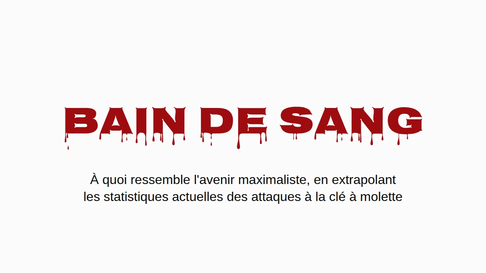

# Bain de sang

Supposons que les maximalistes gagnent. Pas la version objectif de cours, la
vraie : le bitcoin est l'endroit où les gens gardent leur patrimoine, et ils le
gardent comme la communauté le leur recommande, en autoconservation, chez eux.
J'aimerais que ce monde existe. Alors autant se demander à quoi il ressemble
quand on y fait passer les chiffres actuels des attaques à la clé à molette.

La réponse courte, c'est que l'Angleterre et le pays de Galles finiraient par
enterrer des gens à peu près au rythme où l'Ukraine a enterré des civils en
2025, à partir de cambriolages qui ont déjà lieu aujourd'hui. La réponse longue
comporte des réserves, elles sont toutes plus bas, et aucune ne fait
disparaître le problème.

## Une attaque à la clé à molette sur vingt-deux

Jameson Lopp tient un [registre public](https://github.com/jlopp/physical-bitcoin-attacks) des attaques physiques contre des détenteurs de cryptos.
C'est le meilleur relevé qui existe, et c'est un échantillon tiré de la presse,
donc il rate tout ce qui n'a jamais fait l'actualité. J'ai parcouru ses 351
incidents distincts et lu chaque titre qui mentionnait un mort. La recherche
par mots-clés sur laquelle repose le chiffre publié attrape quelques lignes à
tort (une ville qui s'appelle Killingly, deux attaquants abattus par la police,
un meurtre resté à l'état de projet) et en rate quelques vraies (« beaten to
death » ne contient pas « killed »).

Compté à la main : **16 victimes mortes sur 351 incidents, 4,6 %.** Avec un
échantillon de cette taille, la fourchette honnête va d'environ 2,8 % à 7,3 %.
À peu près une attaque à la clé à molette sur vingt-deux se termine par un mort.

C'est un plancher, et pas pour la raison habituelle. Quand un détenteur de
bitcoins est assassiné, ceux qui le pleurent sont très souvent ceux qui
détiennent désormais ses clés. Dire à la police, ou à un journaliste, que la
victime avait des bitcoins, c'est annoncer que quelqu'un dans la maison les a
maintenant. Les meurtres les moins susceptibles d'être enregistrés comme des
attaques liées au bitcoin sont donc exactement ceux où les bitcoins ont
survécu. Personne ne peut chiffrer combien il y en a, et c'est un peu tout le
problème. [*The Denial Spiral*](https://zenodo.org/doi/10.5281/zenodo.22778480)
explique pourquoi ce genre d'angle mort ne se corrige pas tout seul.

Le même silence joue pourtant de l'autre côté de la fraction. Les détenteurs
qui survivent à une attaque ont tout autant de raisons de ne dire à personne ce
qu'ils avaient, si bien que les cas non mortels sont sous-comptés eux aussi.
Les meurtres cachés tirent la vraie proportion vers le haut, les survies
cachées la tirent vers le bas, et personne ne sait lequel des deux effets pèse
le plus. Je prends donc 4,6 % tel quel, et le chiffre tient qu'on le lise avec
prudence ou sans ménagement.

## Seulement quand quelqu'un est là

La plupart des cambriolages ne sont pas des attaques à la clé à molette.
Quelqu'un entre pendant que vous êtes au travail et repart avec l'ordinateur
portable, et dans un monde bitcoin une phrase de récupération gravée sur une
plaque d'acier au fond d'un tiroir partirait de la même façon. Il prend la
plaque, il prend les bitcoins, personne n'est blessé. Dans les termes de
[*The Deadly Race*](https://zenodo.org/doi/10.5281/zenodo.22018891), c'est un succès
net pour le voleur, qui n'a aucune raison de revenir. Laissons donc les maisons
vides entièrement de côté.

Restent les cambriolages où quelqu'un est présent. Ils ont lieu aujourd'hui, en
grand nombre, et en Angleterre et au pays de Galles ils représentent [plus de la
moitié des cambriolages de logements](https://www.ons.gov.uk/peoplepopulationandcommunity/crimeandjustice/articles/overviewofburglaryandotherhouseholdtheft/latest)
où le cambrioleur parvient à entrer. Aujourd'hui, la personne dans la maison est
un obstacle entre un voleur et la télévision. Dans l'hypothèse maximaliste, la
personne dans la maison *est* le coffre-fort : le patrimoine est derrière un
code PIN, une passphrase, un souvenir, et elle se tient juste là. C'est une
attaque à la clé à molette, et les attaques à la clé à molette se terminent par
un mort au moins une fois sur vingt-deux.

## Le calcul

Prenez les cambriolages de logements enregistrés par la police de chaque pays,
gardez seulement la part où quelqu'un est présent, et multipliez par 4,6 %. Pas
de niveau de référence, pas de conversion des maisons vides, aucune hypothèse
sur les conseils que les gens suivent. Juste les morts en plus.

Les traits noirs du graphique, comme la colonne des fourchettes ci-dessous,
montrent où tombe chaque chiffre si la vraie proportion de morts se situe
n'importe où entre 2,8 % et 7,3 %.

| Morts supplémentaires pour 100 000 habitants par an | Estimation | Fourchette |
|---|---:|---:|
| Angleterre et pays de Galles (la moitié des cambriolages avec quelqu'un présent) | **6,2** | 3,8–9,8 |
| États-Unis (28 % avec quelqu'un présent) | 1,5 | 0,9–2,4 |
| **Ukraine, civils tués dans la guerre, 2025** | **6,6–7,6** | |

L'Angleterre et le pays de Galles tombent dans la même fourchette qu'un pays en
guerre : 6,2 morts supplémentaires pour 100 000 habitants par an, contre 6,6 à
7,6 civils tués en Ukraine en 2025, [l'année la plus meurtrière pour les civils depuis 2022](https://ukraine.un.org/en/308241-2025-deadliest-year-civilians-ukraine-2022-un-human-rights-monitors-find).
Le chiffre ukrainien ne compte que les morts civiles vérifiées par l'ONU, aucun
soldat, et l'ONU elle-même le dit très en dessous du bilan réel. C'est le
chiffre de guerre le plus prudent qui existe.

Les États-Unis sortent plus bas, autour d'un quart, surtout parce que bien moins
de cambriolages américains ont lieu avec quelqu'un à la maison ([28 %](https://bjs.ojp.gov/press-release/victimization-during-household-burglary)).
La France et l'Allemagne ne publient pas cette proportion, elles ne figurent
donc pas sur le graphique.

Tout ceci est une extrapolation conditionnelle, pas une prévision. J'ai utilisé
les cambriolages enregistrés par la police, qui sous-comptent ; les enquêtes de
victimation donnent un chiffre réel nettement plus élevé. Le taux de mortalité
vient d'attaques que la presse a choisi de couvrir, ce qui le pousse
probablement vers le haut. Et l'ensemble repose sur une hypothèse, que je
préfère nommer plutôt que cacher : qu'un cambrioleur qui trouve chez lui le
détenteur d'une fortune en bitcoins se comporte comme un attaquant à la clé à
molette. Le registre, ce sont 351 exemples de ce à quoi ressemble ce
comportement.

Et ça ne devient pas moins meurtrier. La part des attaques recensées qui
finissent par un mort est restée entre 4 et 5 % sur toute l'histoire du registre
(4,1 % jusqu'en 2020, 4,1 % pour 2021–23, 5,0 % depuis 2024), pendant que le
nombre d'attaques par an a à peu près doublé. Mêmes chances, plus de lancers.

## Là où ça se passe déjà

Tout ce qui précède porte sur un avenir où tout le monde détient. La suite
concerne ceux qui détiennent aujourd'hui, et c'est le même risque vu de l'autre
bout : le calcul des cambriolages, c'est ce que ça devient une fois toute la
population au dénominateur.

En France, rien de tout cela n'a besoin d'un avenir hypothétique. La France a le
plus d'entrées dans le registre, et ce qui la distingue, c'est la méthode :
57 % des incidents français sont des enlèvements ou des prises d'otages d'après
leur titre, contre environ 35–40 % dans le monde, et neuf des douze cas où les
attaquants ont pris un proche au lieu du détenteur sont français.

Le [parquet national anticriminalité organisée](https://www.franceinfo.fr/economie/bitcoin/cryptomonnaies-plus-de-70-enlevements-et-sequestrations-recenses-sur-les-huit-premiers-mois-de-2026-d-apres-le-parquet-national-anticriminalite-organisee_8188352.html) a compté une vingtaine
d'enlèvements ou de séquestrations liés aux cryptos en 2024, **67 en 2025**, et
plus de soixante-dix sur les huit premiers mois de 2026. Rapporté aux cinq
millions et demi à six millions de détenteurs de cryptos en France (10–11 % des
adultes, d'après les enquêtes du secteur lui-même, [2025](https://www.presse-citron.net/age-revenus-placements-4-choses-a-savoir-sur-les-francais-qui-investissent-dans-les-cryptos/) et [2026](https://journalducoin.com/actualites/adoption-crypto-france-adan-barometre/)), cela fait environ 1,2 pour 100 000 détenteurs en 2025 et 1,8 au
rythme de cette année.

Le Nigeria, tragiquement connu pour ses enlèvements, a compté environ 3,4 enlèvements pour 100 000 habitants sur l'année close en juin 2026, d'après
le [décompte de presse](https://www.ripplesnigeria.com/kidnap-economy-report-says-criminals-made-over-n7-8bn-from-ransoms-in-one-year/) que la plupart des gens citent. Les deux chiffres sont des cas signalés, les deux sont
sous-comptés, et la réputation du Nigeria s'est construite elle aussi sur les
cas signalés.

Le détenteur français moyen reste donc plus en sécurité que le Nigérian moyen.
Mais cette moyenne inclut tous ceux qui ont cinquante euros dans une appli, et
personne ne les enlève. Quatre détenteurs français sur cinq ont moins de
5 000 €. Les attaquants choisissent la richesse visible, donc la comparaison juste se fait avec les gens
qu'ils choisissent, et celle-là peut être bornée sans rien deviner.

La même enquête évalue le total détenu en France à 21–26 milliards d'euros, et
ce seul chiffre plafonne chaque tranche de patrimoine. La France ne peut pas
compter plus d'environ 26 000 personnes avec un million d'euros ou plus en
cryptos, parce que s'il y en avait davantage, elles posséderaient plus que la
totalité. À un demi-million, le plafond est d'environ 52 000 ; à 100 000 €,
d'environ 262 000. Chaque plafond est absurdement généreux, puisqu'il ne laisse
rien du tout aux cinq millions et demi d'autres détenteurs, et un dénominateur
plus grand ne fait que réduire le taux.

Pour le numérateur, je n'ai pris que les cas français, de janvier 2025 à août
2026, où la presse a rapporté ce que le foyer de la victime possédait
réellement :

- le père d'un « millionnaire des cryptos », retenu contre une rançon de
  5 millions d'euros et mutilé avant que la police le libère (Paris, mai 2025) ;
- un employé du secteur crypto dépouillé de 2 millions d'euros en bitcoins
  (Paris, août 2025) ;
- un couple de retraités enlevé pour les 8 millions d'euros de leur fils
  (Sallanches, janvier 2026) ;
- un couple dépouillé de 900 000 € par des hommes se faisant passer pour des
  policiers (Le Chesnay, mars 2026) ;
- une famille de cinq personnes retenue en otage jusqu'à ce qu'elle vire
  700 000 € (Ploudalmézeau, avril 2026).

Tous les autres sont comptés comme des sardines, y compris David Balland, le
cofondateur de Ledger enlevé en janvier 2025 contre une [rançon rapportée](https://www.frenchweb.fr/david-balland-cofondateur-de-ledger-kidnappe-et-libere-apres-une-demande-de-rancon/450873) de 5–10 millions d'euros,
parce que ce qu'il détenait personnellement n'a jamais été publié. On divise, et
on annualise :

| Cryptos détenues | Au plus, en France | Enlèvements pour 100 000 par an, au moins | vs Nigeria (3,4) | vs Haïti (5,5) |
|---|---:|---:|---:|---:|
| 250 000 € et plus | 105 000 | 2,9 | 0,8× | 0,5× |
| 500 000 € et plus | 52 000 | 5,7 | **1,7×** | 1,0× |
| 1 million d'euros et plus | 26 000 | 6,9 | **2,0×** | **1,3×** |
| 2 millions d'euros et plus | 13 000 | 9,2 | **2,7×** | **1,7×** |
| 5 millions d'euros et plus | 5 000 | 11,4 | **3,4×** | **2,1×** |

Le taux grimpe à chaque échelon, et c'est à ça que ressemble un ciblage vu de
l'extérieur. À partir d'environ un tiers de million d'euros, le plancher à lui
seul dépasse le Nigeria.

C'est un plancher bâti sur un plafond : une poignée de cas connus, rapportés à
la plus grande population que l'arithmétique autorise. Le patrimoine de la
plupart des victimes n'est jamais rapporté du tout, donc chaque ligne est
sous-comptée, et les lignes du haut reposent chacune sur un ou deux cas. Comptez
Balland et la ligne du haut double.

À quel point ce plafond est-il lâche ? Le patrimoine au sommet suit une loi de
puissance raide, ce qui veut dire que le vrai nombre de millionnaires en cryptos
en France est très loin en dessous de 26 000, et pas à côté. Une hypothèse moins
extrême : donner à la France sa part ordinaire des millionnaires du monde, un
peu plus de 4 % (2,4 millions sur 57,5 millions, selon
[UBS](https://www.visualcapitalist.com/ranked-countries-with-the-most-millionaires-in-2026/)),
et l'appliquer aux quelque 242 000 millionnaires en cryptos dans le monde
([Henley & Partners](https://www.henleyglobal.com/newsroom/press-releases/crypto-wealth-report-2025)).
Ça donne environ 10 000 personnes, et pour elles un taux d'enlèvement d'environ
**18 pour 100 000 par an, plus de cinq fois le chiffre nigérian**. Celui-là est une
estimation et non un plancher ; le plancher, c'est le tableau.

**Un foyer français qui a un demi-million d'euros en cryptos risque davantage de
voir l'un des siens enlevé qu'un Nigérian ordinaire, en comptant de la même
façon que s'est faite la réputation du Nigeria.**

Haïti, une nation tragiquement effondrée, a connu au moins 647 enlèvements
documentés en 2025 selon le décompte au cas par cas de [la mission de l'ONU](https://binuh.unmissions.org/sites/default/files/2026-01/Quarterly%20Report%20on%20the%20human%20rights%20situation%20in%20Haiti%20%28October%20-%20December%202025%29%20-%20ENGLISH_0.pdf) elle-même, qui le qualifie de
minimum : au moins 5,5 pour 100 000 habitants. À partir d'environ un million
d'euros en cryptos, le plancher français dépasse aussi ce chiffre.

Si la croissance de cette année se maintient, les détenteurs français dans leur
ensemble, sardines comprises, atteignent le taux actuel du Nigeria vers 2028.

Ça n'a pas ralenti. [En septembre](https://cryptoast.fr/crypto-rapts-france-recap-nice-rennes-septembre-2026/), une mère et son fils ont été séquestrés
chez eux à Nice par deux hommes masqués pour un compte de 25 000 $, et en août
une famille près de Rennes a été attaquée par une bande qui s'était trompée de
maison.

## Ça change quand ça fait mal

Personne ne refait sa sécurité parce qu'un argument est bon. On le fait quand
le coût de ne pas le faire devient impossible à ignorer. Quand
[la faille d'aléa de Coldcard](https://github.com/Yuri-SVB/great-wall-posts/tree/main/posts/010-hot-takeaways-of-the-coldcard-hack)
est devenue publique, les consignes de la communauté sont passées en quelques
jours à lancer cinquante dés à la main, une procédure qu'on aurait traitée de
paranoïaque un mois plus tôt. La tolérance à l'effort n'est pas figée. Elle
bouge quand la menace devient lisible.

Ici, la menace est lisible, au moins en France. Ce que le changement doit
accomplir, c'est le critère de [la course mortelle](https://github.com/Yuri-SVB/great-wall-posts/tree/main/posts/006-the-deadly-race) :
une fois que l'attaquant vous tient, vous et tout ce que vous possédez,
l'attaque doit se terminer nettement, soit parce qu'il a l'argent, soit parce
qu'il ne reste plus rien à obtenir. Ce qu'elle ne peut pas faire, c'est laisser
un chemin que vous seul pouvez achever, parce que ce chemin fait de vous son
concurrent, et l'article porte justement sur ce qui arrive aux concurrents.

Great Wall est une construction faite pour passer cette barre, et l'article
explique comment. Ce ne sera pas la dernière, et rien n'oblige à ce que ce soit
celle que vous choisirez. L'avenir maximaliste a besoin d'*une* forme de
conservation qui la passe, sinon il va beaucoup ressembler au graphique.

---

*Le critère, et pourquoi une saisie partielle met un prix sur la vie du
détenteur, sont dans* [***The Deadly Race***](https://zenodo.org/doi/10.5281/zenodo.22018891)*.
Pourquoi le démenti, les leurres et la discrétion s'usent, et pourquoi le relevé
sous-compte, c'est dans* [***The Denial Spiral***](https://zenodo.org/doi/10.5281/zenodo.22778480)*.
Les deux en accès libre, sans inscription.*

*Données d'incidents issues du* [*registre de Jameson Lopp*](https://github.com/jlopp/physical-bitcoin-attacks)*,
instantané du 13 août 2026. Cambriolages :* [*SSMSI*](https://www.interieur.gouv.fr/Interstats/Actualites/Insecurite-et-delinquance-en-2025-bilan-statistique-et-atlas-departemental) *(France,
2025),* [*ONS*](https://www.gov.uk/government/statistics/crime-in-england-and-wales-year-ending-march-2025) *(Angleterre et pays de Galles, année close en mars 2025),*
[*FBI*](https://cde.ucr.cjis.gov/) *(États-Unis, 2024),* [*PKS*](https://www.bundesregierung.de/breg-de/aktuelles/polizeiliche-kriminalstatistik-2025-2422020) *(Allemagne, 2025). Homicides :*
[*SSMSI*](https://www.interieur.gouv.fr/Interstats/Infractions-et-sentiment-d-insecurite/Homicides-et-tentatives-d-homicides)*,* [*ONS*](https://www.ons.gov.uk/peoplepopulationandcommunity/crimeandjustice/articles/homicideinenglandandwales/yearendingmarch2025)*,* [*FBI*](https://cde.ucr.cjis.gov/)*,*
[*UNODC*](https://data.worldbank.org/indicator/VC.IHR.PSRC.P5?locations=DE-UA)*. Cambriolages avec quelqu'un présent :* [*BJS*](https://bjs.ojp.gov/press-release/victimization-during-household-burglary)*,*
[*ONS*](https://www.ons.gov.uk/peoplepopulationandcommunity/crimeandjustice/articles/overviewofburglaryandotherhouseholdtheft/latest)*. Ukraine :* [*OHCHR*](https://ukraine.un.org/en/308241-2025-deadliest-year-civilians-ukraine-2022-un-human-rights-monitors-find) *2025. Enlèvements
en France :* [*PNACO*](https://www.franceinfo.fr/economie/bitcoin/cryptomonnaies-plus-de-70-enlevements-et-sequestrations-recenses-sur-les-huit-premiers-mois-de-2026-d-apres-le-parquet-national-anticriminalite-organisee_8188352.html)*. Haïti :* [*BINUH*](https://binuh.unmissions.org/sites/default/files/2026-01/Quarterly%20Report%20on%20the%20human%20rights%20situation%20in%20Haiti%20%28October%20-%20December%202025%29%20-%20ENGLISH_0.pdf) *2025.
Nigeria :* [*SBM Intelligence*](https://www.ripplesnigeria.com/kidnap-economy-report-says-criminals-made-over-n7-8bn-from-ransoms-in-one-year/)*, juillet 2025 à juin 2026. Détenteurs
et total détenu :* [*ADAN/Deloitte/Ipsos 2025*](https://www.presse-citron.net/age-revenus-placements-4-choses-a-savoir-sur-les-francais-qui-investissent-dans-les-cryptos/)*,*
[*ADAN 2026*](https://journalducoin.com/actualites/adoption-crypto-france-adan-barometre/)*.*

---

**Si ça valait votre temps.** Passez-le à celui qui vous a convaincu de votre
dispositif actuel. Une ⭐ sur [Great Wall](https://github.com/Yuri-SVB/Great-Wallet),
sur [la recherche](https://github.com/Yuri-SVB/great-wall-docs) ou sur
[ces textes](https://github.com/Yuri-SVB/great-wall-posts) ne coûte rien et rend
le travail plus facile à trouver. Et si vous voulez le financer,
[support](https://github.com/Yuri-SVB/support) accepte ⚡ Lightning et on-chain,
sans inscription, sans paliers et sans contrepartie.
