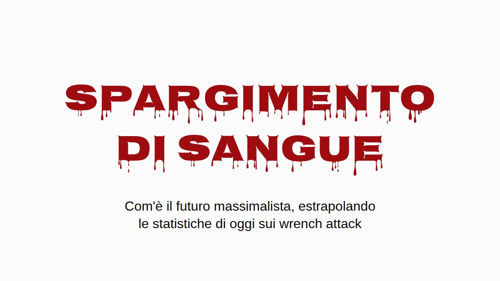

# Spargimento di sangue

Mettiamo che i massimalisti vincano. Non la versione col prezzo obiettivo,
quella vera: bitcoin è dove la gente tiene la propria ricchezza, e la tiene
come le dice la comunità, in autocustodia, a casa. A me piacerebbe che quel
mondo esistesse. Per questo mi sembra il caso di chiedersi che aspetto ha se
ci fai passare dentro i numeri di oggi sui wrench attack.

La risposta breve è che Inghilterra e Galles finirebbero per seppellire gente
più o meno al ritmo con cui l'Ucraina ha seppellito civili nel 2025, per furti
in casa che succedono già oggi. La risposta lunga ha delle avvertenze, sono
tutte qui sotto, e nessuna fa sparire il problema.

## Un wrench attack su ventidue

Jameson Lopp tiene un [registro pubblico](https://github.com/jlopp/physical-bitcoin-attacks) degli attacchi fisici contro chi detiene cripto.
È la migliore documentazione che esista, ed è un campione preso dalla stampa,
quindi gli sfugge tutto quello che sui giornali non ci è mai arrivato. Mi sono
passato tutti i 351 episodi distinti che contiene e ho letto ogni titolo che
parlava di un morto. La ricerca per parola chiave su cui poggia la cifra
pubblicata pesca qualche riga sbagliata (una cittadina che si chiama
Killingly, due aggressori uccisi dalla polizia, un omicidio che era solo in
progetto) e ne perde qualcuna vera ("beaten to death" non corrisponde a
"killed").

Contati a mano: **16 vittime morte in 351 episodi, il 4,6%.** Con un campione
di queste dimensioni l'intervallo onesto va più o meno dal 2,8% al 7,3%. Circa
un wrench attack su ventidue finisce con un morto.

È un pavimento, e non per il solito motivo. Quando chi detiene bitcoin viene
ucciso, chi lo piange è molto spesso chi adesso ha le sue chiavi. Dire alla
polizia, o a un giornalista, che la vittima aveva bitcoin vuol dire annunciare
che adesso ce li ha qualcun altro in quella casa. Così gli omicidi che hanno
meno probabilità di finire registrati come attacchi legati a bitcoin sono
proprio quelli in cui le monete sono sopravvissute. Nessuno può dire quanti
siano, e il punto è un po' questo. La [Denial Spiral](https://zenodo.org/doi/10.5281/zenodo.22778480)
spiega perché un punto cieco del genere non si corregge da solo.

Lo stesso silenzio però lavora anche sull'altro lato della frazione. Chi
sopravvive a un attacco ha altrettanti motivi per non dire a nessuno cosa
aveva, quindi anche i casi non mortali sono sottostimati. Gli omicidi nascosti
spingono la quota vera in su, le sopravvivenze nascoste la spingono in giù, e
nessuno sa dire quale delle due pesi di più. Quindi il 4,6% lo prendo per
quello che è, e regge sia che tu lo legga con prudenza sia in modo aggressivo.

## Solo quando c'è qualcuno in casa

La maggior parte dei furti in casa non sono wrench attack. Qualcuno entra
mentre sei al lavoro e se ne va col portatile, e in un mondo bitcoin una seed
phrase punzonata su una piastra d'acciaio nel cassetto farebbe la stessa fine.
Prende la piastra, prende le monete, nessuno si fa male. Nei termini della
[Deadly Race](https://zenodo.org/doi/10.5281/zenodo.22018891), per il ladro è un
successo netto, senza nessun motivo per tornare. Quindi le case vuote lasciale
proprio fuori dal conto.

Restano comunque i furti con qualcuno in casa. Succedono già adesso, in gran
numero, e in Inghilterra e Galles sono [più della metà di tutti i furti in
abitazione](https://www.ons.gov.uk/peoplepopulationandcommunity/crimeandjustice/articles/overviewofburglaryandotherhouseholdtheft/latest)
in cui il ladro riesce a entrare. Oggi chi è in casa è un ostacolo fra un
ladro e il televisore. Nella premessa massimalista chi è in casa *è* la
cassaforte: la ricchezza sta dietro un PIN, una passphrase, un ricordo, e lui
è lì in piedi. Questo è un wrench attack, e i wrench attack finiscono con un
morto almeno una volta su ventidue.

## I conti

Prendi i furti in abitazione registrati dalla polizia in ogni paese, tieni
solo la quota con qualcuno in casa e moltiplica per 4,6%. Nessuna linea di
base, nessuna conversione delle case vuote, nessuna ipotesi su quali consigli
segua la gente. Solo i morti in più.

Le linee nere nel grafico, e la colonna dell'intervallo qui sotto, mostrano
dove finisce ogni cifra se la quota vera di morti sta ovunque fra il 2,8% e il
7,3%.

| Morti in più per 100.000 all'anno | Stima | Intervallo |
|---|---:|---:|
| Inghilterra e Galles (metà dei furti con qualcuno in casa) | **6,2** | 3,8–9,8 |
| Stati Uniti (28% con qualcuno in casa) | 1,5 | 0,9–2,4 |
| **Ucraina, civili uccisi in guerra, 2025** | **6,6–7,6** | |

Inghilterra e Galles finiscono nella stessa fascia di un paese in guerra: 6,2
morti in più per 100.000 all'anno, contro i 6,6–7,6 civili uccisi in Ucraina
nel 2025, [l'anno più letale per i civili dal 2022](https://ukraine.un.org/en/308241-2025-deadliest-year-civilians-ukraine-2022-un-human-rights-monitors-find).
La cifra ucraina conta solo i morti civili verificati dall'ONU, nessun
soldato, e l'ONU stessa dice che è ben sotto il bilancio reale. Come numero di
guerra, più prudente di così non se ne trovano.

Gli Stati Uniti vengono più bassi, circa un quarto, soprattutto perché molti
meno furti americani avvengono con qualcuno in casa ([28%](https://bjs.ojp.gov/press-release/victimization-during-household-burglary)).
Francia e Germania quella quota non la pubblicano, quindi nel grafico non ci
sono.

Tutto questo è un'estrapolazione condizionale, non una previsione. Ho usato i
furti registrati dalla polizia, che sono sottostimati; le indagini di
vittimizzazione mettono il numero reale parecchio più in alto. Il tasso di
mortalità viene da attacchi che la stampa ha scelto di raccontare, e questo
probabilmente lo gonfia. E il tutto poggia su un'ipotesi, che preferisco
nominare invece di nasconderla: che un ladro che trova in casa chi possiede
una fortuna in bitcoin si comporti come chi fa un wrench attack. Il registro è
351 casi di come si presenta quel comportamento.

E non sta diventando meno letale. La quota di attacchi registrati che finisce
con un morto è rimasta al 4–5% per tutta la storia del registro (4,1% fino al
2020, 4,1% nel 2021–23, 5,0% dal 2024), mentre il numero di attacchi all'anno è
più o meno raddoppiato. Stesse probabilità, più tiri di dado.

## Dove succede già

Tutto quello che c'è sopra riguarda un futuro in cui ce l'hanno tutti. Quello
che segue riguarda chi ce l'ha adesso, ed è lo stesso rischio visto dall'altro
capo: il conto dei furti in casa è quello che diventa quando al denominatore
c'è l'intera popolazione.

In Francia non serve nessun futuro ipotetico. La Francia ha più voci di
chiunque altro nel registro, e a distinguerla è il metodo: il 57% degli
episodi francesi sono rapimenti o prese di ostaggi, a giudicare dal titolo,
contro circa il 35–40% nel mondo, e nove dei dodici casi in cui gli aggressori
hanno preso un parente invece di chi deteneva le monete sono francesi.

La [procura nazionale contro la criminalità organizzata](https://www.franceinfo.fr/economie/bitcoin/cryptomonnaies-plus-de-70-enlevements-et-sequestrations-recenses-sur-les-huit-premiers-mois-de-2026-d-apres-le-parquet-national-anticriminalite-organisee_8188352.html) ha contato una ventina di
rapimenti o sequestri di persona legati alle cripto nel 2024, **67 nel 2025**,
e più di settanta nei primi otto mesi del 2026. Spalmati sui cinque milioni e
mezzo, sei milioni di francesi che detengono cripto (il 10–11% degli adulti,
secondo i sondaggi del settore stesso, [2025](https://www.presse-citron.net/age-revenus-placements-4-choses-a-savoir-sur-les-francais-qui-investissent-dans-les-cryptos/) e [2026](https://journalducoin.com/actualites/adoption-crypto-france-adan-barometre/)), fanno circa 1,2 ogni 100.000 detentori nel 2025 e 1,8 al ritmo di
quest'anno.

La Nigeria, tragicamente nota per i rapimenti, ha avuto circa 3,4 sequestri ogni 100.000 abitanti nei dodici mesi fino a giugno 2026, secondo
il [conteggio della stampa](https://www.ripplesnigeria.com/kidnap-economy-report-says-criminals-made-over-n7-8bn-from-ransoms-in-one-year/) che citano quasi tutti. Entrambi i numeri sono casi denunciati,
entrambi sono sottostime, e anche la reputazione della Nigeria si è costruita
su quelli denunciati.

Quindi il detentore francese medio è ancora più al sicuro del nigeriano medio.
Ma in quella media c'è chiunque abbia cinquanta euro in un'app, e quelli non li
rapisce nessuno. Quattro detentori francesi su cinque hanno meno di 5.000 €. Gli aggressori scelgono la ricchezza visibile, quindi il confronto giusto
è con le persone che scelgono, e quello si può delimitare senza tirare a
indovinare niente.

Lo stesso sondaggio mette il totale detenuto in Francia a 21–26 miliardi di
euro, e quel solo numero fa da tetto a ogni fascia di ricchezza. In Francia
non possono esserci più di circa 26.000 persone con un milione di euro o più
in cripto, perché se fossero di più possiederebbero più del totale. A mezzo
milione il tetto è circa 52.000; a 100.000 €, circa 262.000. Ogni tetto è
assurdamente generoso, visto che non lascia proprio niente agli altri cinque
milioni e mezzo di detentori, e un denominatore più grande non fa che
abbassare il tasso.

Per il numeratore ho preso solo i casi francesi, da gennaio 2025 ad agosto
2026, in cui la stampa ha riportato quanto aveva davvero la famiglia della
vittima:

- il padre di un «milionario delle cripto», tenuto prigioniero per un riscatto
  di 5 milioni di € e mutilato prima che la polizia lo liberasse (Parigi,
  maggio 2025);
- un addetto del settore cripto derubato di 2 milioni di € in bitcoin (Parigi,
  agosto 2025);
- una coppia di pensionati rapita per gli 8 milioni di € del figlio
  (Sallanches, gennaio 2026);
- una coppia derubata di 900.000 € da uomini che si spacciavano per poliziotti
  (Le Chesnay, marzo 2026);
- una famiglia di cinque persone tenuta in ostaggio finché non ha trasferito
  700.000 € (Ploudalmézeau, aprile 2026).

Tutti gli altri contano come sardine, compreso David Balland, il cofondatore
di Ledger preso a gennaio 2025 per un [riscatto riportato](https://www.frenchweb.fr/david-balland-cofondateur-de-ledger-kidnappe-et-libere-apres-une-demande-de-rancon/450873) di 5–10 milioni di €,
perché quanto avesse lui personalmente non è mai stato pubblicato. Dividi e
annualizza:

| Cripto detenute | Al massimo in Francia | Rapiti per 100.000 all'anno, almeno | vs Nigeria (3,4) | vs Haiti (5,5) |
|---|---:|---:|---:|---:|
| Da 250.000 € | 105.000 | 2,9 | 0,8× | 0,5× |
| Da 500.000 € | 52.000 | 5,7 | **1,7×** | 1,0× |
| Da 1 milione di € | 26.000 | 6,9 | **2,0×** | **1,3×** |
| Da 2 milioni di € | 13.000 | 9,2 | **2,7×** | **1,7×** |
| Da 5 milioni di € | 5.000 | 11,4 | **3,4×** | **2,1×** |

Il tasso sale a ogni gradino, che è l'aspetto che ha la scelta dei bersagli
vista da fuori. Da circa un terzo di milione di euro in su, il solo pavimento
batte la Nigeria.

È un pavimento costruito su un soffitto: una manciata di casi noti divisa per
la popolazione più grande che l'aritmetica permette. Quanto avesse la maggior
parte delle vittime non viene mai riportato, quindi ogni riga è una
sottostima, e le righe più alte poggiano su uno o due casi ciascuna. Conta
Balland e la riga più alta raddoppia.

Quanto è largo il soffitto? La ricchezza in cima segue una legge di potenza
ripida, il che vuol dire che i milionari francesi delle cripto sono molti meno
di 26.000, e nemmeno vicini. Un'ipotesi meno estrema: dai alla Francia la sua
quota ordinaria dei milionari del mondo, poco più del 4% (2,4 milioni su 57,5
milioni, secondo
[UBS](https://www.visualcapitalist.com/ranked-countries-with-the-most-millionaires-in-2026/)),
e applicala ai circa 242.000 milionari delle cripto nel mondo
([Henley & Partners](https://www.henleyglobal.com/newsroom/press-releases/crypto-wealth-report-2025)).
Sono circa 10.000 persone, e per loro un tasso di rapimento di circa **18 ogni
100.000 all'anno, più di cinque volte la cifra nigeriana**. Quella però è una
stima; il pavimento resta la tabella.

**Una famiglia francese con mezzo milione di euro in cripto ha più probabilità
di vedersi rapire qualcuno di un nigeriano qualunque, contando nello stesso
modo in cui si è fatta la reputazione della Nigeria.**

Haiti, una nazione tragicamente collassata, ha avuto almeno 647 rapimenti
documentati nel 2025 secondo il conteggio caso per caso della [missione ONU](https://binuh.unmissions.org/sites/default/files/2026-01/Quarterly%20Report%20on%20the%20human%20rights%20situation%20in%20Haiti%20%28October%20-%20December%202025%29%20-%20ENGLISH_0.pdf), che lo
definisce un minimo: almeno 5,5 ogni 100.000 abitanti. Da circa un milione di
euro in cripto in su, il pavimento francese sta sopra anche a questo.

Se la crescita di quest'anno tiene, i detentori francesi nel loro insieme,
sardine comprese, arrivano al tasso attuale della Nigeria verso il 2028.

E non ha rallentato. [A settembre](https://cryptoast.fr/crypto-rapts-france-recap-nice-rennes-septembre-2026/) una madre e suo figlio sono stati
sequestrati in casa a Nizza da due uomini mascherati per un conto da 25.000 $,
e ad agosto una famiglia vicino a Rennes è stata aggredita da una banda che
aveva sbagliato casa.

## Cambia quando fa male

La gente non riprogetta la propria sicurezza perché un argomento è valido. Lo
fa quando il costo di non farlo diventa impossibile da ignorare. Quando il
[bug di casualità di Coldcard](https://github.com/Yuri-SVB/great-wall-posts/tree/main/posts/010-hot-takeaways-of-the-coldcard-hack)
è diventato pubblico, nel giro di pochi giorni le indicazioni della comunità
sono passate a tirare cinquanta dadi a mano, una procedura che un mese prima
sarebbe stata liquidata come paranoia. La fatica che la gente è disposta a
fare si sposta, e si sposta quando la minaccia diventa leggibile.

Qui la minaccia è leggibile già adesso, almeno in Francia. Quello che il
cambiamento deve ottenere è il criterio della [Deadly Race](https://github.com/Yuri-SVB/great-wall-posts/tree/main/posts/006-the-deadly-race):
dopo che un aggressore ha in mano te e tutto quello che possiedi, l'attacco
deve finire nettamente, o perché ce l'ha lui o perché non gli resta niente da
prendere. Quello che non può fare è lasciare un percorso che solo tu puoi
portare a termine, perché quel percorso fa di te il suo concorrente, e il
paper parla proprio di cosa succede ai concorrenti.

Great Wall è una costruzione fatta per superare quell'asticella, e il paper
spiega come. Non sarà l'ultima, e non serve che sia quella che scegli tu. Il
futuro massimalista ha bisogno di *una qualche* custodia che la superi,
altrimenti finirà per somigliare parecchio al grafico.

---

*Il criterio, e perché un sequestro parziale mette un prezzo sulla vita di chi
detiene, sono in*
[***The Deadly Race***](https://zenodo.org/doi/10.5281/zenodo.22018891)*. Perché
smentite, esche e discrezione si consumano, e perché il registro sottostima, lo
trovi in*
[***The Denial Spiral***](https://zenodo.org/doi/10.5281/zenodo.22778480)*. Tutti e
due ad accesso aperto, senza registrazione.*

*Dati sugli episodi dal* [*registro di Jameson Lopp*](https://github.com/jlopp/physical-bitcoin-attacks)*,
istantanea del 13 agosto 2026. Furti in abitazione:* [*SSMSI*](https://www.interieur.gouv.fr/Interstats/Actualites/Insecurite-et-delinquance-en-2025-bilan-statistique-et-atlas-departemental) *(Francia,
2025),* [*ONS*](https://www.gov.uk/government/statistics/crime-in-england-and-wales-year-ending-march-2025) *(Inghilterra e Galles, anno fino a marzo 2025),*
[*FBI*](https://cde.ucr.cjis.gov/) *(USA, 2024),* [*PKS*](https://www.bundesregierung.de/breg-de/aktuelles/polizeiliche-kriminalstatistik-2025-2422020) *(Germania, 2025). Omicidi:*
[*SSMSI*](https://www.interieur.gouv.fr/Interstats/Infractions-et-sentiment-d-insecurite/Homicides-et-tentatives-d-homicides)*,* [*ONS*](https://www.ons.gov.uk/peoplepopulationandcommunity/crimeandjustice/articles/homicideinenglandandwales/yearendingmarch2025)*,* [*FBI*](https://cde.ucr.cjis.gov/)*,*
[*UNODC*](https://data.worldbank.org/indicator/VC.IHR.PSRC.P5?locations=DE-UA)*. Furti con qualcuno in casa:* [*BJS*](https://bjs.ojp.gov/press-release/victimization-during-household-burglary)*,*
[*ONS*](https://www.ons.gov.uk/peoplepopulationandcommunity/crimeandjustice/articles/overviewofburglaryandotherhouseholdtheft/latest)*. Ucraina:* [*OHCHR*](https://ukraine.un.org/en/308241-2025-deadliest-year-civilians-ukraine-2022-un-human-rights-monitors-find) *2025. Rapimenti
in Francia:* [*PNACO*](https://www.franceinfo.fr/economie/bitcoin/cryptomonnaies-plus-de-70-enlevements-et-sequestrations-recenses-sur-les-huit-premiers-mois-de-2026-d-apres-le-parquet-national-anticriminalite-organisee_8188352.html)*. Haiti:* [*BINUH*](https://binuh.unmissions.org/sites/default/files/2026-01/Quarterly%20Report%20on%20the%20human%20rights%20situation%20in%20Haiti%20%28October%20-%20December%202025%29%20-%20ENGLISH_0.pdf) *2025.
Nigeria:* [*SBM Intelligence*](https://www.ripplesnigeria.com/kidnap-economy-report-says-criminals-made-over-n7-8bn-from-ransoms-in-one-year/)*, da luglio 2025 a giugno 2026. Detentori
e totale detenuto:* [*ADAN/Deloitte/Ipsos 2025*](https://www.presse-citron.net/age-revenus-placements-4-choses-a-savoir-sur-les-francais-qui-investissent-dans-les-cryptos/)*,*
[*ADAN 2026*](https://journalducoin.com/actualites/adoption-crypto-france-adan-barometre/)*.*

---

**Se è valso il tuo tempo.** Mandalo a chi ti ha convinto del tuo assetto
attuale. Una ⭐ su [Great Wall](https://github.com/Yuri-SVB/Great-Wallet),
sulla [ricerca](https://github.com/Yuri-SVB/great-wall-docs) o su
[questi testi](https://github.com/Yuri-SVB/great-wall-posts) non ti costa nulla e
rende il lavoro trovabile. E se vuoi finanziarlo,
[support](https://github.com/Yuri-SVB/support) accetta ⚡ Lightning e on-chain,
senza registrazione, senza livelli e senza nulla in cambio.
