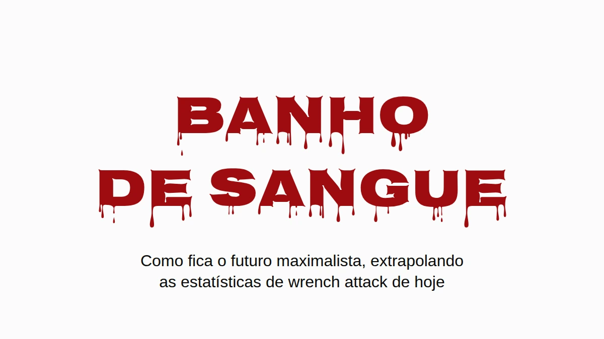

# Banho de sangue

Suponha que os maximalistas ganhem. Não a versão da meta de preço, a de verdade:
bitcoin é onde as pessoas guardam o que têm, e guardam do jeito que a comunidade
manda, em custódia própria, em casa. Eu gostaria que esse mundo existisse.
Justamente por isso vale perguntar como ele fica quando você passa os números de
wrench attack de hoje por ele.

A resposta curta é que a Inglaterra e o País de Gales iam acabar enterrando
gente mais ou menos no ritmo em que a Ucrânia enterrou civis em 2025, por causa
de arrombamentos que já acontecem hoje. A resposta longa tem ressalvas, e estão
todas aí embaixo, mas nenhuma delas faz o problema sumir.

## Um wrench attack em vinte e dois

Jameson Lopp mantém um [registro
público](https://github.com/jlopp/physical-bitcoin-attacks) de ataques físicos
contra quem tem cripto. É o melhor registro que existe, e é uma amostra tirada
da imprensa, então perde tudo que nunca virou notícia. Passei pelos 351
incidentes distintos dele e li cada manchete que mencionava uma morte. A busca
por palavra-chave em que o número publicado se apoia pega algumas linhas erradas
(uma cidade chamada Killingly, dois atacantes baleados pela polícia, um
assassinato que só chegou a ser planejado) e deixa passar algumas de verdade
("beaten to death" não bate com "killed").

Contando na mão: **16 vítimas mortas em 351 incidentes, 4,6%.** Com uma amostra
desse tamanho, a faixa honesta vai de uns 2,8% a 7,3%. Mais ou menos um wrench
attack em cada vinte e dois termina com alguém morto.

Isso é um piso, e não pelo motivo de sempre. Quando alguém que tem bitcoin é
assassinado, quem chora por ele muitas vezes é justamente quem ficou com as
chaves. Contar à polícia, ou a um repórter, que a vítima tinha bitcoin é
anunciar que agora alguém naquela casa tem. Então as mortes com menos chance de
entrar no registro como ataque a bitcoin são exatamente aquelas em que as moedas
sobreviveram. Ninguém consegue pôr número nisso, e em boa medida a questão é
essa. O [Denial Spiral](https://zenodo.org/doi/10.5281/zenodo.22778480) explica por que
esse tipo de ponto cego não se corrige sozinho.

Só que o mesmo silêncio age do outro lado da fração. Quem sobrevive a um ataque
tem tanto motivo quanto para não contar a ninguém o que tinha, então os casos
não fatais também ficam subcontados. As mortes escondidas empurram a proporção
real para cima, as sobrevivências escondidas empurram para baixo, e ninguém sabe
dizer qual das duas pesa mais. Por isso eu pego os 4,6% pelo valor de face, e o
número se sustenta quer você leia com cautela, quer com agressividade.

## Só quando tem alguém em casa

A maioria dos arrombamentos não é wrench attack. Alguém entra enquanto você está
no trabalho e sai com o notebook, e num mundo bitcoin uma seed phrase gravada
numa placa de aço na gaveta ia pelo mesmo caminho. Leva a placa, leva as moedas,
ninguém se machuca. Nos termos do [Deadly
Race](https://zenodo.org/doi/10.5281/zenodo.22018891), isso é um sucesso claro para o
ladrão, sem motivo nenhum para voltar. Então deixe as casas vazias completamente
de fora.

Sobram os arrombamentos com alguém em casa. Eles acontecem hoje, em grande
número, e na Inglaterra e no País de Gales são [mais da metade dos arrombamentos
de
residência](https://www.ons.gov.uk/peoplepopulationandcommunity/crimeandjustice/articles/overviewofburglaryandotherhouseholdtheft/latest)
em que o ladrão consegue entrar. Hoje quem está em casa é um obstáculo entre o
ladrão e a televisão. Na premissa maximalista, quem está em casa *é* o cofre: a
riqueza está atrás de um PIN, de uma passphrase, de uma memória, e a pessoa está
bem ali, de pé. Isso é um wrench attack, e wrench attacks terminam em morte pelo
menos uma vez em vinte e duas.

## A aritmética

Pegue os arrombamentos de residência registrados pela polícia em cada país,
fique só com a parte em que havia alguém em casa e multiplique por 4,6%. Sem
linha de base, sem converter casa vazia, sem supor nada sobre qual conselho as
pessoas seguem. Só as mortes a mais.

As linhas pretas no gráfico, e a coluna de faixa aqui embaixo, mostram onde cada
número cai se a proporção real de mortes estiver em qualquer ponto entre 2,8% e
7,3%.

| Mortes a mais por 100.000 por ano | Estimativa | Faixa |
|---|---:|---:|
| Inglaterra e País de Gales (metade dos arrombamentos com alguém em casa) | **6,2** | 3,8–9,8 |
| Estados Unidos (28% com alguém em casa) | 1,5 | 0,9–2,4 |
| **Ucrânia, civis mortos na guerra, 2025** | **6,6–7,6** | |

A Inglaterra e o País de Gales caem na mesma faixa de um país em guerra: 6,2
mortes a mais por 100.000 por ano, contra 6,6 a 7,6 civis mortos na Ucrânia em
2025, [o ano mais letal para civis desde
2022](https://ukraine.un.org/en/308241-2025-deadliest-year-civilians-ukraine-2022-un-human-rights-monitors-find).
O número ucraniano é só de mortes de civis verificadas pela ONU, sem soldados, e
a própria ONU diz que ele fica bem abaixo do total real. É o número de guerra
mais conservador que existe.

Os EUA saem mais baixo, cerca de um quarto disso, principalmente porque muito
menos arrombamentos americanos acontecem com alguém em casa
([28%](https://bjs.ojp.gov/press-release/victimization-during-household-burglary)).
França e Alemanha não publicam essa proporção, então ficaram fora do gráfico.

Tudo aqui é extrapolação condicional, e não previsão. Usei arrombamentos
registrados pela polícia, que subcontam; as pesquisas de vitimização põem o
número real bem mais alto. A taxa de mortes vem de ataques que a imprensa
escolheu noticiar, o que provavelmente puxa ela para cima. E a coisa toda se
apoia numa suposição, que eu prefiro nomear a esconder: que um ladrão que
encontra em casa o dono de uma fortuna em bitcoin se comporta como quem faz
wrench attack. O registro são 351 casos de como esse comportamento é.

E não está ficando menos letal. A parte dos ataques registrados que termina em
morte ficou em 4–5% ao longo da história do registro (4,1% até 2020, 4,1% em
2021–23, 5,0% desde 2024), enquanto o número de ataques por ano mais ou menos
dobrou. Mesma chance, mais jogadas de dado.

## Onde já está acontecendo

Tudo aí em cima é sobre um futuro em que todo mundo tem. O que vem agora é sobre
quem tem hoje, e é o mesmo risco visto pela outra ponta: a aritmética dos
arrombamentos é o que isso vira quando a população inteira entra no denominador.

Na França, nada disso precisa de futuro hipotético. A França tem o maior número
de entradas no registro, e o que a diferencia é o método: 57% dos incidentes
franceses são sequestros ou tomadas de reféns pela manchete, contra uns 35–40%
no mundo, e nove dos doze casos em que os atacantes pegaram um parente em vez de
quem tinha as moedas são franceses.

O [promotor nacional de crime
organizado](https://www.franceinfo.fr/economie/bitcoin/cryptomonnaies-plus-de-70-enlevements-et-sequestrations-recenses-sur-les-huit-premiers-mois-de-2026-d-apres-le-parquet-national-anticriminalite-organisee_8188352.html)
contou uns vinte sequestros ou cárceres privados ligados a cripto em 2024, **67
em 2025**, e mais de setenta nos oito primeiros meses de 2026. Espalhado pelos
cinco milhões e meio a seis milhões de detentores de cripto na França (10–11%
dos adultos, pelas pesquisas do próprio setor,
[2025](https://www.presse-citron.net/age-revenus-placements-4-choses-a-savoir-sur-les-francais-qui-investissent-dans-les-cryptos/)
e
[2026](https://journalducoin.com/actualites/adoption-crypto-france-adan-barometre/)),
isso dá cerca de 1,2 por 100.000 detentores em 2025 e 1,8 no ritmo deste ano.

A Nigéria, tragicamente famosa por sequestros, teve cerca de 3,4 raptos por
100.000 habitantes no ano até junho de 2026, pela [contagem da
imprensa](https://www.ripplesnigeria.com/kidnap-economy-report-says-criminals-made-over-n7-8bn-from-ransoms-in-one-year/)
que quase todo mundo cita. Os dois números são casos noticiados, os dois são
subcontagens, e a reputação da Nigéria também foi feita em cima dos noticiados.

Então o francês médio com cripto ainda está mais seguro que o nigeriano médio.
Só que essa média inclui todo mundo com cinquenta euros num app, e ninguém
sequestra essa gente. Quatro em cada cinco franceses com cripto têm menos de
€5.000. Atacante escolhe riqueza visível, então a comparação justa é com as
pessoas que eles escolhem, e essa dá para limitar sem chutar nada.

A mesma pesquisa põe o total em mãos francesas em €21–26 bilhões, e esse número
sozinho põe teto em toda faixa de patrimônio. A França não pode ter mais do que
umas 26.000 pessoas com um milhão de euros ou mais em cripto, porque se houvesse
mais elas teriam mais do que o total inteiro. Com meio milhão o teto fica em
umas 52.000; com €100.000, umas 262.000. Cada teto é absurdamente generoso, já
que não deixa nada para os outros cinco milhões e meio de detentores, e um
denominador maior só faz a taxa encolher.

Para o numerador peguei só os casos franceses, de janeiro de 2025 a agosto de
2026, em que a imprensa noticiou quanto a família da vítima tinha de fato:

- o pai de um "milionário cripto", mantido refém por um resgate de €5 milhões
  e mutilado antes de a polícia libertá-lo (Paris, maio de 2025);
- um profissional do setor cripto roubado em €2 milhões em bitcoin (Paris,
  agosto de 2025);
- um casal aposentado sequestrado pelos €8 milhões do filho (Sallanches,
  janeiro de 2026);
- um casal roubado em €900.000 por homens que se passaram por policiais (Le
  Chesnay, março de 2026);
- uma família de cinco pessoas mantida refém até transferir €700.000
  (Ploudalmézeau, abril de 2026).

Todo o resto conta como sardinha, inclusive David Balland, o cofundador da
Ledger levado em janeiro de 2025 por um [resgate
noticiado](https://www.frenchweb.fr/david-balland-cofondateur-de-ledger-kidnappe-et-libere-apres-une-demande-de-rancon/450873)
de €5–10 milhões, porque o que ele tinha pessoalmente nunca foi publicado.
Divida e anualize:

| Cripto em mãos | No máximo, quantos na França | Sequestrados por 100.000 por ano, no mínimo | vs Nigéria (3,4) | vs Haiti (5,5) |
|---|---:|---:|---:|---:|
| €250.000+ | 105.000 | 2,9 | 0,8× | 0,5× |
| €500.000+ | 52.000 | 5,7 | **1,7×** | 1,0× |
| €1 milhão+ | 26.000 | 6,9 | **2,0×** | **1,3×** |
| €2 milhões+ | 13.000 | 9,2 | **2,7×** | **1,7×** |
| €5 milhões+ | 5.000 | 11,4 | **3,4×** | **2,1×** |

A taxa sobe a cada degrau, e é assim que escolha de alvo aparece vista de fora.
De mais ou menos um terço de milhão de euros para cima, só o piso já passa a
Nigéria.

É um piso construído em cima de um teto: um punhado dos casos conhecidos sobre a
maior população que a aritmética permite. A maioria das vítimas nunca tem o
patrimônio noticiado, então toda linha é subcontagem, e as linhas de cima se
apoiam em um ou dois casos cada. Conte o Balland e a linha do topo dobra.

Quão frouxo é esse teto? Riqueza no topo segue uma lei de potência íngreme, o
que quer dizer que o número real de milionários cripto franceses está muito
abaixo de 26.000, nem perto disso. Um chute menos extremo: dê à França a parte
normal dela dos milionários do mundo, pouco mais de 4% (2,4 milhões de 57,5
milhões, pelo
[UBS](https://www.visualcapitalist.com/ranked-countries-with-the-most-millionaires-in-2026/)),
e aplique isso aos cerca de 242.000 milionários cripto do mundo ([Henley &
Partners](https://www.henleyglobal.com/newsroom/press-releases/crypto-wealth-report-2025)).
Dá umas 10.000 pessoas, e uma taxa de sequestro para elas de cerca de **18 por
100.000 por ano, mais de cinco vezes o número nigeriano**. Esse aí é estimativa.
O piso é a tabela.

**Uma família francesa com meio milhão de euros em cripto tem mais chance de ter
alguém sequestrado do que um nigeriano comum, contando do mesmo jeito com que se
fez a reputação da Nigéria.**

O Haiti, uma nação tragicamente colapsada, teve pelo menos 647 sequestros
documentados em 2025 pela contagem caso a caso da [própria missão da
ONU](https://binuh.unmissions.org/sites/default/files/2026-01/Quarterly%20Report%20on%20the%20human%20rights%20situation%20in%20Haiti%20%28October%20-%20December%202025%29%20-%20ENGLISH_0.pdf),
que ela chama de mínimo: pelo menos 5,5 por 100.000 habitantes. De mais ou menos
um milhão de euros em cripto para cima, o piso francês passa desse também.

Se o crescimento deste ano se mantiver, os detentores franceses como um todo,
sardinhas incluídas, chegam à taxa atual da Nigéria lá por 2028.

E não desacelerou. [Em
setembro](https://cryptoast.fr/crypto-rapts-france-recap-nice-rennes-septembre-2026/)
uma mãe e o filho foram mantidos em casa em Nice por dois homens mascarados por
causa de uma conta de US$25.000, e uma família perto de Rennes foi atacada em
agosto por um bando que tinha errado de casa.

## Muda quando dói

Ninguém redesenha a própria segurança porque um argumento é bom. A gente
redesenha quando o custo de não fazer isso fica impossível de ignorar. Quando o
[bug de aleatoriedade da
Coldcard](https://github.com/Yuri-SVB/great-wall-posts/tree/main/posts/010-hot-takeaways-of-the-coldcard-hack)
veio a público, a orientação da comunidade mudou em poucos dias para jogar
cinquenta dados na mão, um procedimento que um mês antes teria sido descartado
como paranoia. A tolerância a esforço se mexe, e se mexe quando a ameaça fica
legível.

Aqui a ameaça já está legível, pelo menos na França. O que a mudança precisa
alcançar é o critério do [Deadly
Race](https://github.com/Yuri-SVB/great-wall-posts/tree/main/posts/006-the-deadly-race):
depois que o atacante tem você e tudo que você possui, o ataque tem que acabar
claramente, ou porque ele já tem tudo ou porque não sobrou nada para ele pegar.
O que ela não pode é deixar um caminho que só você consegue terminar, porque
esse caminho te transforma em concorrente dele, e o paper é sobre o que acontece
com concorrentes.

O Great Wall é uma construção feita para passar nessa régua, e o paper explica
como. Não vai ser a última, e não precisa ser a que você escolhe. O futuro
maximalista precisa de *alguma* custódia que passe nela, ou vai ficar muito
parecido com o gráfico.

---

*O critério, e por que uma apreensão parcial põe preço na vida de quem tem as
moedas, estão em* [***The Deadly
Race***](https://zenodo.org/doi/10.5281/zenodo.22018891)*. Por que negação, iscas e
discrição se desgastam, e por que o registro subconta, está em* [***The Denial
Spiral***](https://zenodo.org/doi/10.5281/zenodo.22778480)*. Os dois em acesso aberto,
sem cadastro.*

*Dados de incidentes do* [*registro de Jameson
Lopp*](https://github.com/jlopp/physical-bitcoin-attacks)*, snapshot de 13 de
agosto de 2026. Contagens de arrombamentos:*
[*SSMSI*](https://www.interieur.gouv.fr/Interstats/Actualites/Insecurite-et-delinquance-en-2025-bilan-statistique-et-atlas-departemental)
*(França, 2025),*
[*ONS*](https://www.gov.uk/government/statistics/crime-in-england-and-wales-year-ending-march-2025)
*(Inglaterra e País de Gales, ano até março de 2025),*
[*FBI*](https://cde.ucr.cjis.gov/) *(EUA, 2024),*
[*PKS*](https://www.bundesregierung.de/breg-de/aktuelles/polizeiliche-kriminalstatistik-2025-2422020)
*(Alemanha, 2025). Homicídios:*
[*SSMSI*](https://www.interieur.gouv.fr/Interstats/Infractions-et-sentiment-d-insecurite/Homicides-et-tentatives-d-homicides)*,*
[*ONS*](https://www.ons.gov.uk/peoplepopulationandcommunity/crimeandjustice/articles/homicideinenglandandwales/yearendingmarch2025)*,*
[*FBI*](https://cde.ucr.cjis.gov/)*,*
[*UNODC*](https://data.worldbank.org/indicator/VC.IHR.PSRC.P5?locations=DE-UA)*.
Arrombamentos com alguém em casa:*
[*BJS*](https://bjs.ojp.gov/press-release/victimization-during-household-burglary)*,*
[*ONS*](https://www.ons.gov.uk/peoplepopulationandcommunity/crimeandjustice/articles/overviewofburglaryandotherhouseholdtheft/latest)*.
Ucrânia:*
[*OHCHR*](https://ukraine.un.org/en/308241-2025-deadliest-year-civilians-ukraine-2022-un-human-rights-monitors-find)
*2025. Sequestros na França:*
[*PNACO*](https://www.franceinfo.fr/economie/bitcoin/cryptomonnaies-plus-de-70-enlevements-et-sequestrations-recenses-sur-les-huit-premiers-mois-de-2026-d-apres-le-parquet-national-anticriminalite-organisee_8188352.html)*.
Haiti:*
[*BINUH*](https://binuh.unmissions.org/sites/default/files/2026-01/Quarterly%20Report%20on%20the%20human%20rights%20situation%20in%20Haiti%20%28October%20-%20December%202025%29%20-%20ENGLISH_0.pdf)
*2025. Nigéria:* [*SBM
Intelligence*](https://www.ripplesnigeria.com/kidnap-economy-report-says-criminals-made-over-n7-8bn-from-ransoms-in-one-year/)*,
julho de 2025 a junho de 2026. Detentores e total em mãos:*
[*ADAN/Deloitte/Ipsos
2025*](https://www.presse-citron.net/age-revenus-placements-4-choses-a-savoir-sur-les-francais-qui-investissent-dans-les-cryptos/)*,*
[*ADAN
2026*](https://journalducoin.com/actualites/adoption-crypto-france-adan-barometre/)*.*

---

**Se isso valeu seu tempo.** Mande para quem te convenceu do seu arranjo atual.
Uma ⭐ no [Great Wall](https://github.com/Yuri-SVB/Great-Wallet), na
[pesquisa](https://github.com/Yuri-SVB/great-wall-docs) ou [nestes
textos](https://github.com/Yuri-SVB/great-wall-posts) não custa nada e faz o
trabalho ser encontrado. E se você quiser financiá-lo, o
[apoio](https://github.com/Yuri-SVB/support) aceita ⚡ Lightning e on-chain, sem
cadastro, sem níveis e sem contrapartida nenhuma.
